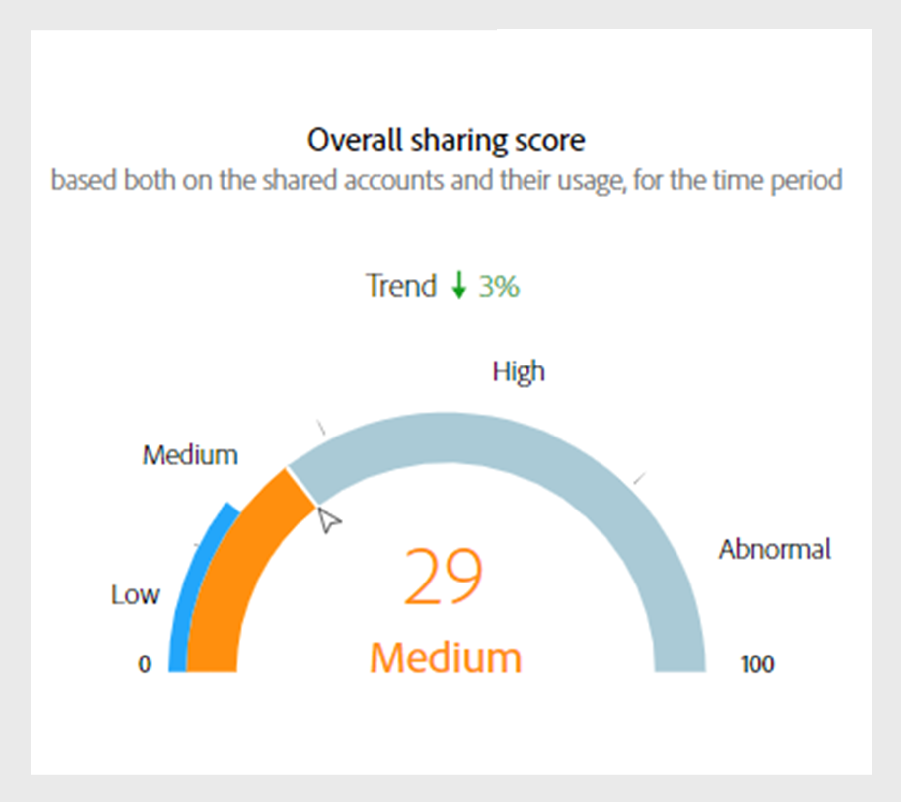

# 仪表板上的数据面板 {#data-panels}

选择区段和时间间隔后，仪表板将显示各种数据面板、表格和图形，以反映所选区段内共享活动的高级视图。

下表概述了不同类别的数据面板之间的可用性和差异 [版本](/help/accountiq/versions-aiq.md) 帐户IQ的：

| 数据面板 | D2C服务 | TVE程序员 | TVE MVPDs |
|---|---|---|---|
| [当前区段汇总的平均共享分数](#aggregated-sharing) | 可用且一致 | 可用且一致 | 可用且一致 |
| [区段中的视频类别](#video-categories-segment) | 提供时略有变化 | 提供时略有变化 | 提供时略有变化 |
| [按渠道和MVPD共享得分](#sharin-score-by-channels-and-mvpds) | 不可用 | 可用 | 不可用 |
| [帐户共享概率](#accounts-sharing-probability) | 可用且一致 | 可用且一致 | 可用且一致 |
| [通过共享概率级别进行的帐户数和使用情况](#number-of-accounts-usage-sharing-probability) | 可用且一致 | 可用且一致 | 可用且一致 |

## 为当前区段汇总的平均共享分数 {#aggregated-sharing}

“平均共享分数”面板提供顶级读数，以总结帐户和流数量方面的共享数量和影响。

这些量度可帮助您了解订阅者共享凭据的大小（从低、中、高到异常），以帐户和使用情况来衡量。

*当前区段在面板上汇总的平均共享得分*

>[!NOTE]
>
> 中的蓝色指示器 **为当前区段汇总的平均共享分数** 与TV Everywhere相比，D2C服务的用途各不相同。 对于D2C服务，它代表 **服务平均索引** 如上图所示。 如果您以程序员或MVPD身份登录，则此标签将更改为 **行业平均指数**.

以下量度是“平均共享分数”面板的组件。

### 共享级别 {#sharing-level}

共享级别量规显示所选时间间隔内定义段内所有共享订户帐户的百分比。

百分比是根据为区段中的每个帐户计算的平均共享概率计算的。 此计算包括在所选时间间隔内至少流式处理过一次的帐户。

趋势指示器显示指标值相对于上一个时间间隔的百分比变化。

{width="350" align="left"}

*共享级别*

### 共享帐户的使用情况 {#usage-from-shared-accounts}

该量规指示共享帐户在定义的段和时间段内所有订阅者帐户中的使用百分比。 这些范围分别名为“低”、“中”、“高”和“异常”，它们基于行业平均值。

趋势指示器，用于描述与上一个时间间隔相比，共享帐户的使用率上升或下降。

{width="350" align="left"}

*共享帐户的使用情况*

### 总体共享得分 {#overall-sharing-score}

总体共享分数是共享分数的组合，包括“共享级别”和“来自共享帐户的使用情况”。

它提供的分数反映了共享的总体影响。 其目的类似于信用评分，用单个数字汇总共享级别。 但在本例中，分数越高，共享级别越高。

{width="350" align="left"}

*总体共享得分*

## 区段中的视频类别 {#video-categories-segment}

您可以选择列标题来对帐户IQ的所有版本中的数据排序。

+++D2C服务：区段中的区域

以D2C服务身份登录时， **区段中的区域** 表格提供各地区不同汇总分享分数的比较视图， [视频类别](/help/accountiq/product-concepts.md#video-category-def) 于当前区段。

*按区段中的区域共享得分*

>[!NOTE]
>
> 此 [视频类别](product-concepts.md#video-category-def)  如上图所示，例如 **地区** 只是个例子。 登录Account IQ时，此面板会显示您公司的特定视频类别。

选择 **导出** 以.csv文件格式下载数据。 学习 [如何导出数据面板报告](/help/accountiq/export-reports.md).

+++

+++程序员：区段中的MVPD

当您以程序员身份登录时， **区段中的MVPD** 表提供当前分部内MVPD之不同汇总共享分数的比较视图。

选择 **导出** 以.csv文件格式下载数据。 学习 [如何导出数据面板报告](/help/accountiq/export-reports.md).

+++

+++MVPDs：区段中的程序员

当您以MVPD身份登录时， **区段中的程序员** 表格提供当前分部程序员不同汇总分享分数的比较视图。

选择列标题以对数据进行排序。

*程序员在区段中共享得分*

选择 **导出** 以.csv文件格式下载数据。 学习 [如何导出数据面板报告](/help/accountiq/export-reports.md).

+++

## 按渠道和MVPD共享得分  {#sharin-score-by-channels-and-mvpds}

当您以程序员身份登录时，此表提供当前区段中MVPD所选渠道的共享分数的比较视图。

选择列标题以对数据进行排序。

*按渠道和MVPD共享得分*

## 帐户共享概率 {#accounts-sharing-probability}

此图表将按概率分成5个等级，从极低(0-20%)到极高(80-100%)不等。 详细了解 [帐户共享概率](#accounts-sharing-probability).

>[!NOTE]
>
>条形图使用对数刻度。

*不同共享概率范围内的订户帐户的数量和百分比*

## 通过共享概率级别进行的帐户数和使用情况 {#number-of-accounts-usage-sharing-probability}

此面板提供按共享概率五分位数的范围划分的帐户的表格视图，范围从非常低(0-20%)到非常高(80-100%)，每个五分位数的关联使用情况来自共享帐户。 详细了解 [帐户共享概率](#accounts-sharing-probability).

*处于各种概率范围内的帐户、趋势和使用情况的数量*

选择 **导出** 以.csv文件格式下载数据。 学习 [如何导出数据面板报告](/help/accountiq/export-reports.md).

