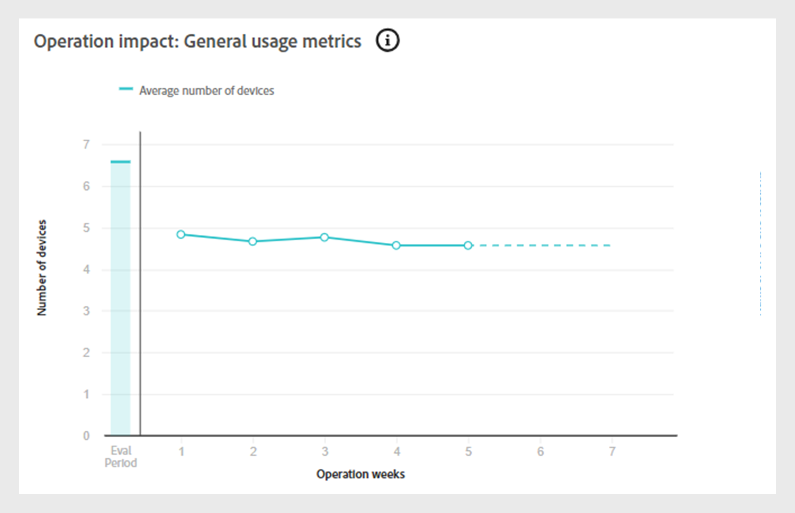

# 操作 {#operations-tab-next-steps}

分析订阅者的使用模式并通过以下方式识别选定区段的密码共享实例后 [!DNL Account IQ] analytics中，您可以通过在中称为操作的重点过程执行目标操作 [!DNL Account IQ].

**操作** 允许您有效地跟踪和管理针对一组帐户的凭据共享，以缓解密码共享并增强重要订阅者的体验。

您可以将操作应用到已定义的 [区段](/help/accountiq/product-concepts.md#segment-def) 解决特定密码共享问题 [时间间隔](/help/accountiq/product-concepts.md#time-interval-def) 并安排在将来的日期执行该操作。 这些操作包括最小化密码共享或放宽非共享帐户限制的限制。

使用操作，您不仅可以指定操作及其范围，还可以衡量其结果。

通过评估结果，您可以优化策略以优化效果，无论是通过转化借款人、减少凭据共享还是减少流失。

您可以通过操作执行各种功能：

* [查看工序报表](#operation-reports)
* [创建新操作](#create-new-operation)
* [停止操作](#stop-operation)

## 查看工序报表 {#operation-reports}

您可以通过操作报告来查看操作效果。 要查看工序报表，请选择 **操作** 选项卡在 **操作** 帐户IQ应用程序的左侧面板中。 此时将显示系统中可用的操作列表。 您可以采用表格格式访问有关每个操作的键详细信息。 详细信息包括：

* 操作的名称
* 当前状态（例如，已计划、正在运行、已结束、错误或已停止）
* 进度完成百分比
* 对其应用操作的目标受众或区段
* 为操作选择的操作类型
* 操作的开始日期
* 操作的结束日期
* 创建操作的日期
* 操作的上次修改日期

*Account IQ中现有操作的列表和详细信息*

选择所需的 **操作名称** 操作列表中的。 将显示以下报告：

### 操作性能 {#operation-performance}

操作性能提供顶行读数，汇总操作期间该区段中受影响的帐户数、操作进度和帐户的整体共享分数 [评估期](/help/accountiq/product-concepts.md#evaluation-period-def).

*操作性能报表*

**答：** 受影响的帐户 **B.** 操作进度 **C.** 总体共享得分

#### 受影响的帐户 {#impacted-accounts}

此数字显示受操作评估期间采取的操作影响的订户帐户的计数。

#### 操作进度 {#operation-progress}

此量规显示超出计划时间表的天数以及操作完成的百分比。

#### 总体共享得分 {#overall-sharing-score}

此线形图表示 [总体共享分数](/help/accountiq/data-panels.md#overall-sharing-score)，其中包括在操作的评估期间每周共享帐户的共享级别和使用情况。

### 运营影响：段中的帐户 {#impact-accounts}

此报表显示为栈叠的柱状图，以说明操作随时间推移产生的影响。

*操作对区段图中的帐户的影响*

x轴表示操作的 [评估期](/help/accountiq/product-concepts.md#evaluation-period-def)，而y轴指示操作区段中的帐户状态。 图形中的每个条形图都分为三种颜色：

* 粉红色表示满足该区段在此操作中使用的条件的帐户数。

* 蓝色表示在操作的每周或每月最初位于区段中但不满足区段条件的活动帐户数 [评估期](/help/accountiq/product-concepts.md#evaluation-period-def).

* 灰色表示在评估期间处于非活动状态的帐户。

>[!NOTE]
>
>第一个粉红色条表示在评估期开始时符合运营区段条件的帐户数。

随着时间的推移，此图表将说明帐户行为相对于原始标准的变化（例如，共享概率超过90且使用5台以上的设备变得不活动）。

### 操作影响：共享帐户指标 {#impact-shared-accounts}

共享帐户度量提供操作期间操作区段中的订户帐户的共享级别和播放请求的概述 [评估期](/help/accountiq/product-concepts.md#evaluation-period-def).

#### 共享级别 {#share-level}

此线形图表示 [共享级别](/help/accountiq/data-panels.md#sharing-level) 在操作的评估期内，每周进行一次。

{width="550" align="left"}

*共享级别折线图*

#### 播放请求数 {#play-requests}

此线形图表示 [播放请求](/help/accountiq/general-usage-reports.md#playreq-uniquesubs) 在操作的评估期内的每一周。

{width="550" align="left"}

*播放请求数量折线图*

### 操作影响：常规使用量度 {#impact-general-usage}

常规使用量度概述了操作执行期间操作区段中的平均设备、IP和位置数量 [评估期](/help/accountiq/product-concepts.md#evaluation-period-def).

#### 设备数量 {#devices}

此线形图表示平均值 [设备数量](/help/accountiq/general-usage-reports.md#devices-week-account) 在操作的评估期内的每一周。

{width="550" align="left"}

*设备数量折线图*

#### IP和位置数量 {#IPs-locations}

此线形图表示平均值 [IP数量](/help/accountiq/general-usage-reports.md#ip-week-account) 和 [位置](/help/accountiq/general-usage-reports.md#locations-week-account) 在操作的评估期内的每一周。

{width="550" align="left"}

*IP数量和位置折线图*

要关闭报告并返回主页面，请执行以下操作 **操作** 页面，选择 **操作** 选项卡在 **操作** 在左侧面板中。

## 创建新操作 {#create-new-operation}

当您转到 **操作** 选项卡在 **操作** 在左侧面板中，选择 **创建新操作** 在顶部 **操作** 页面。

要创建新操作，请按照以下部分中的说明进行操作：

* [操作详细信息](#operation-details)
* [区段](#segment)
* [操作](#action)
* [计划](#schedule)

### 操作详细信息 {#operation-details}

在此部分中，键入操作的名称 **操作名称**.

>[!TIP]
>
>描述操作的目的或操作的性质 **操作名称** 以便快速识别。 选项 **添加描述和标记** 将在未来版本中提供。

*添加操作名称*

### 区段 {#segment}

在此部分中，单击 **选择区段** 并选择要使用此操作的区段。 学习 [如何选择区段](/help/accountiq/segments-timeinterval.md#segment-selection).

选择区段后，使用  图标以查看详细的区段摘要。 详细了解 [区段摘要](segments-timeinterval.md#segment-summary).

*选择区段和时间间隔*

>[!NOTE]
>
>此 [视频类别](product-concepts.md#video-category-def) 如上图所示，例如 **MVPDs**， **程序员**、和 **渠道** 表示在TV Everywhere版本的Account IQ中使用的标签。 如果您以D2C服务身份登录，则这些标签会显示您公司的特定视频类别。

如果需要，请使用  图标以编辑选定的区段或   图标以创建新区段。 有关更多详细信息，请参阅 [创建新区段](work-with-segments.md#create-new-segment) 或 [编辑区段](work-with-segments.md#edit-segment).

>[!IMPORTANT]
>
>**区段类型** 已命名 **[!UICONTROL Fixed number of accounts]** 当前默认选中。 要选择的选项 **[!UICONTROL Variable number of accounts]** 将在即将发布的版本中提供。

选择 **粒度和时间间隔** 以监视特定期间的操作。 了解更多关于 [如何选择粒度和时间间隔](/help/accountiq/segments-timeinterval.md#granularity-timeinterval).

### 操作 {#action}

在此部分中，选择 **操作** 要从下拉菜单对所选区段执行。

*选择操作类型*

有两个可用选项：

* 选择 **CM策略** 用于集成了Account IQ的并发监控系统。

* 选择 **外部操作** 创建和处理帐户IQ外部且未与Account IQ系统集成的工作流。

>[!NOTE]
>
>外部操作可能并不总是与密码共享直接相关，但仍会影响密码共享，例如启动新季。

### 计划 {#schedule}

在此部分中，选择 **开始日期** 和 **结束日期** 从日期选取器设置操作的激活。

>[!IMPORTANT]
>
>当前，默认激活 **开始日期** 和 **结束日期** 设置为 **日期**. 要选择的选项 **当满足条件时** 和 **手动** 将在即将发布的版本中提供。

>[!NOTE]
>
>确保开始日期和结束日期均与在中为评估选择的粒度一致 **步骤4**.

* 如果已选择按周汇总粒度，请选择以周为单位的开始和结束日期（例如，第10周）。
* 如果已选择按月聚合粒度，请选择以月为单位的开始和结束日期。

*从日期选取器中选择开始日期和结束日期*

**答：** 开始日期选取器 **B.** 结束日期选取器

>[!NOTE]
>
>此 **开始日期** 必须晚于评估期和当前日期，而 **结束日期** 必须晚于开始日期和当前日期，才能在将来期间计划和执行工序。

选择 **保存操作** 在顶部 **操作** 页面以处理新操作。

## 停止操作 {#stop-operation}

您只能停止当前位于中的操作 **正在运行** 状态。 要停止现有操作，请执行以下步骤：

1. 导航至 **操作** 选项卡在 **操作** 帐户IQ应用程序的左侧导航区域中。
1. 选择 **选项** 要停止的操作的菜单。

   

   *选择“选项”菜单以停止操作*

1. 选择 **停止**.

