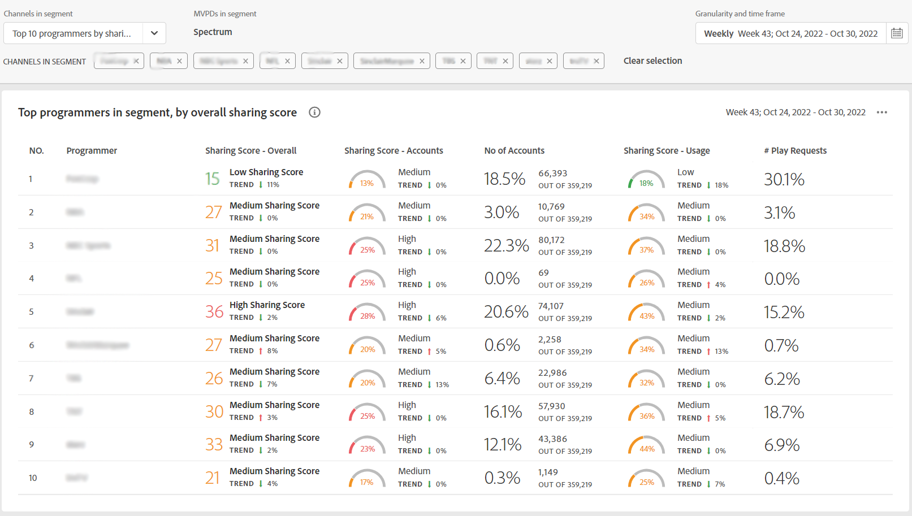
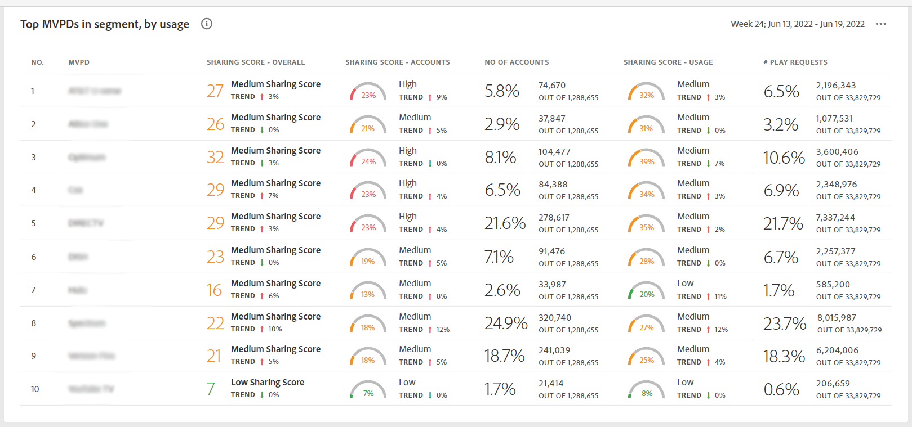

# 查看排名前10的程序员的帐户共享报表 {#view-top-10-programmer-reports}

帐户IQ具有一些功能，可帮助您查看和分析订阅者对前10名程序员的帐户共享统计信息(在定义的 [区段](/help/accountiq/product-concepts.md#segmet-def))具有：

* 共享帐户的订阅者的最高百分比

* 共享帐户中具有最大使用量的订阅者

* 密码共享量度（总体共享分数）最高的订阅者

>[!NOTE]
>
>计算的基础是从一个区段中获取顶级程序员的列表，是整个视频流行业的数据，而不仅仅是一位MVPD的编程人员。

<!--
>[!NOTE]
>
>Only the MVPDs that have a minimum of 50,000 active subscriber accounts are considered to obtain these reports.
-->

对于已登录的MVPD用户，以下三种默认选项（查看前10个MVPD的报表）可用：

* [前10名程序员（按分享得分）](#top-10prog-sharingscore)

* [按使用量列出的10大程序员](#top-10prog-usage)

* [按帐户划分的前10名程序员](#top-10prog-accounts)

## 前10名程序员（按分享得分） {#top-10prog-sharingscore}

当您使用选定内容时 **前10名程序员（按共享得分）** 为了定义您的区段，Account IQ系统将从整个行业中识别10个MVPD，按照其降序顺序列出最多十个MVPD（及其相应的量度） [总体共享分数](/help/accountiq/product-concepts.md#overall-sharing-score)

要通过共享渠道的分数查看排名前10的MVPD的列表和报表，请执行以下操作：

1. 使用 [区段和时间范围面板](/help/accountiq/segments-timeframe.md)，以按照中的步骤定义区段 [如何定义区段并选择时间范围](/help/accountiq/howto-select-segment-timeframe.md) 以进行评估。 对于此评估，选择 **前10名程序员（按共享得分）** MVPD列表中的选项。

1. 从以下任一位置选择报表页面 [常规使用](/help/accountiq/general-usage-reports.md)， [共享帐户](/help/accountiq/shared-acc-reports.md)， [使用模式](/help/accountiq/usage-patterns.md)，或 [仪表板](/help/accountiq/dashboard.md) （仪表板可让您从不同的报表页面中一览选定的图表）。

每个页面都将反映该活动。

## 按使用量列出的10大程序员 {#top-10prog-usage}

当您使用选定内容时 **[!UICONTROL top 10 programmers by usage]** 为了定义您的区段，Account IQ系统将从整个行业中识别10个MVPD，按照其降序顺序列出最多十个MVPD（及其相应的量度） [共享帐户的使用情况](/help/accountiq/product-concepts.md)

要通过共享渠道的分数查看排名前10的MVPD的列表和报表，请执行以下操作：

1. 使用 [[!UICONTROL segment and timeframe panel]](/help/accountiq/segments-timeframe.md)，以按照中的步骤定义区段 [如何定义区段并选择时间范围](/help/accountiq/howto-select-segment-timeframe.md) 以进行评估。 对于此评估，选择 **[!UICONTROL top 10 programmers by usage]** MVPD列表中的选项。

1. 从以下任一位置选择报表页面 [[!UICONTROL General Usage]](/help/accountiq/general-usage-reports.md)， [[!UICONTROL Shared Accounts]](/help/accountiq/shared-acc-reports.md)， [[!UICONTROL Usage Patterns]](/help/accountiq/usage-patterns.md)，或 [[!UICONTROL Dashboard]](/help/accountiq/dashboard.md) （仪表板可让您从不同的报表页面中一览选定的图表）。

每个页面都将反映该活动。

## 按帐户划分的前10名程序员 {#top-10prog-accounts}

当您使用选定内容时 **[!UICONTROL top 10 progrmmers by accounts]** 为了定义您的区段，Account IQ系统按照行业中的降序将10个MVPD标识为一个最多包含10个MVPD（及其相应量度）的列表 [共享级别](/help/accountiq/product-concepts.md)

要查看按帐户数划分的前10个MVPD的列表和报表，这些帐户是为您的渠道共享的：

1. 使用 [区段和时间范围面板](/help/accountiq/segments-timeframe.md)，以按照中的步骤定义区段 [如何定义区段并选择时间范围](/help/accountiq/howto-select-segment-timeframe.md) 以进行评估。 对于此评估，选择 **[!UICONTROL top 10 programmers by account]** MVPD列表中的选项。

1. 从以下任一位置选择报表页面 [[!UICONTROL General Usage]](/help/accountiq/general-usage-reports.md)， [[!UICONTROL Shared Accounts]](/help/accountiq/shared-acc-reports.md)， [[!UICONTROL Usage Patterns]](/help/accountiq/usage-patterns.md)，或 [[!UICONTROL Dashboard]](/help/accountiq/dashboard.md) （仪表板可让您从不同的报表页面中一览选定的图表）。

每个页面都将反映该活动。

