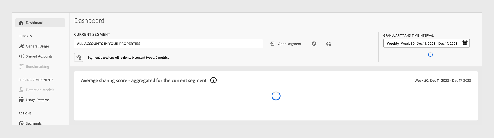

# 对Account IQ中的问题进行故障诊断 {#troubleshoot}

如果您在加载数据和图表时遇到延迟、导出报告时遇到困难，或者遇到任何其他与量度或图表相关的问题，请继续阅读以获取及时的故障排除帮助。

* 如果页面或单个面板加载时间过长，请尝试刷新页面。 对于当前版本，根据当前区段，页面加载可能最多需要一分钟。

  

* 如果刷新后仍看不到任何数据或图形，请注销Account IQ，然后重新登录。

* 如果上述故障排除方法都没有帮助，或者您还有其他与数据相关或无法导出统计数据的问题，请通过向<tve-support@adobe.com>发送电子邮件来联系Adobe支持部门。
