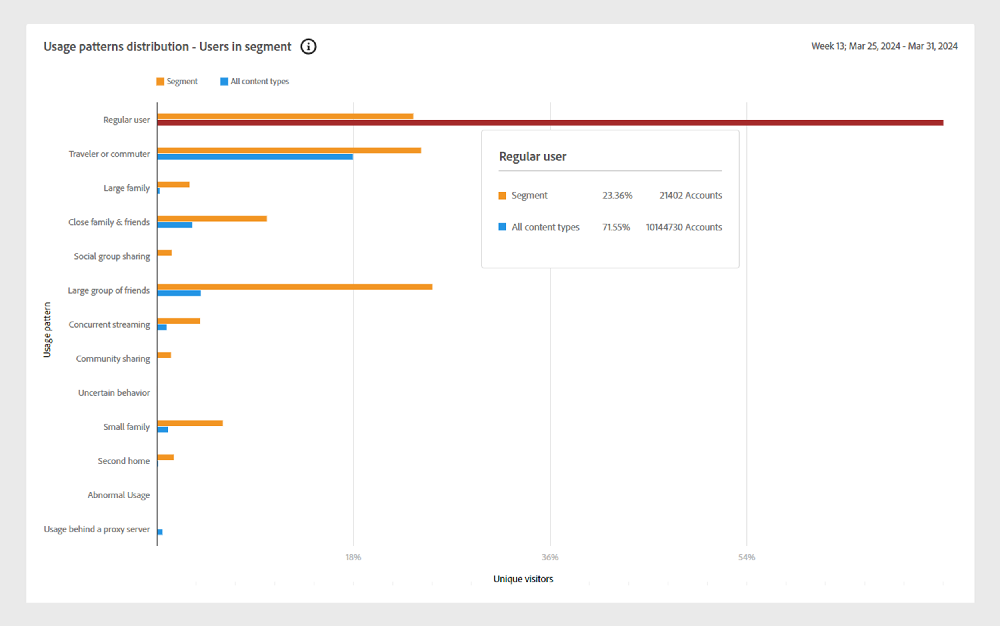

# 使用模式 {#usage-patterns}

Account IQ根据订阅者的社交行为将订阅者帐户用户分为不同类别，例如旅行者或通勤者、大家庭和社区共享。 **使用模式**&#x200B;页面会显示这些用户类型的多个不同分析和报告。 例如，**使用模式分布**&#x200B;报告将当前区段的使用行为与您的所有帐户的使用行为进行比较。

与应用程序中的其他页面一样，此处的分析和报表基于[区段面板](/help/accountiq/segments-timeinterval.md)中定义的当前区段。

## 使用模式分布 {#usage-pattern-dis}

聚类条形图描述每个社交行为或使用模式的订阅者的数量和百分比。

+++D2C服务：使用模式分布 — 区段中的用户

下面的群集条形图将比较当前区段与包含所有帐户的区段的使用模式分布。

*使用模式分布 — 区段中的用户*

+++

+++TV Everywhere：使用模式分布 — 用户细分与行业

除了将当前区段中的每个使用模式与整个行业进行比较外，还会将它们与包含您的所有账户的区段进行比较。

*使用模式分布 — 区段中的用户与行业*

+++

## 区段中的使用模式分布 {#usage-pattern-dis-segment}

**[!UICONTROL Usage patterns distribution in segment]**&#x200B;面板为每个用户模式列出了以下信息：

* 个人帐户所属的共享概率范围。
* 该模式中帐户的数量和百分比。
* 该类别中订阅者播放请求的总使用量和百分比。

*区段中的使用模式分布*

例如，在上面的可视化图表中：

* 在定义的区段中，常规用户（仅在一个位置拥有有限数量设备的一对少数人）的帐户共享概率为5%到13%。

* 在总订户账户（536 640个）中，70.2%（376 615个）为普通用户。

* 在总播放请求（6,512,593个）中，有44.5%（2,896,346个）由普通用户发出。

## 视频类别的使用模式分发 {#usage-pattern-dis-video-categories}

+++D2C服务：区域的使用模式分布

**[!UICONTROL Usage pattern distribution]**&#x200B;表提供了当前区段中[视频类别](product-concepts.md##video-category-def)的使用模式比较。

区域&#x200B;*的使用模式分布*

>[!NOTE]
>
>上图中所示的视频类别（如&#x200B;**区域**）只是一个示例。 登录到Account IQ时，标签会显示您公司的特定视频类别。

+++

+++程序员：MVPD的使用模式分布

**[!UICONTROL Usage pattern distribution]**&#x200B;表提供了当前区段中MVPD的使用模式分布比较。

*程序员的使用模式分布*

+++

+++MVPD：程序员的使用模式分布

**[!UICONTROL Usage pattern distribution]**&#x200B;表提供了当前区段中程序员或渠道的使用模式分布比较。

*MVPD的使用模式分布*

+++
