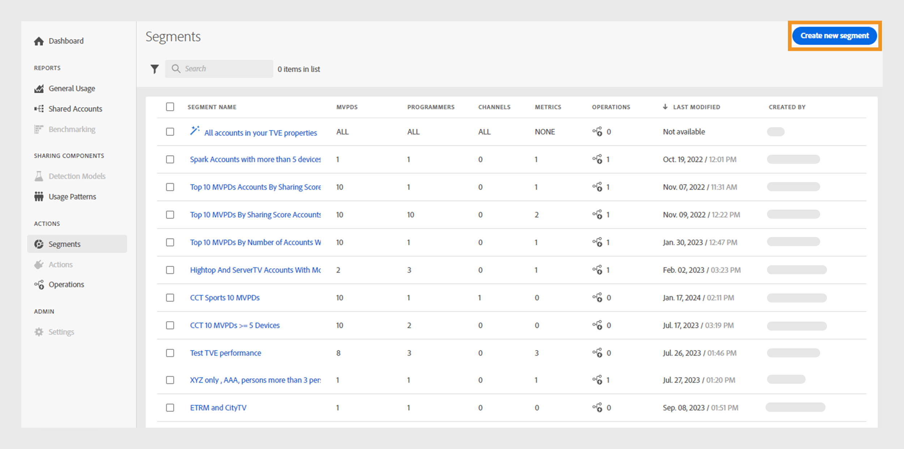

# 使用区段 {#work-with-segments}

[区段](product-concepts.md#segmet-def) 是订阅者帐户的集合，允许您在用户定义的条件下分析凭据共享。 您可以使用区段检查不同的订户帐户集，并在表和图形中生成相应的数据报告。 Account IQ中有两种类型的区段：

1. **默认区段**： **您的资产中的所有帐户** 是系统中的现成区段，包含所有未应用特定条件的活动订阅者帐户。

   >[!NOTE]
   >
   >使用默认区段可能会阻止显示某些表，如 [区段中的视频类别](data-panels.md#video-categories-segment)， [按渠道和MVPD共享得分](data-panels.md#sharin-score-by-channels-and-mvpds)、和 [视频类别的使用模式分发](usage-patterns.md#usage-pattern-dis-video-categories). 这些表一次最多只能容纳和显示20行的数据。 其余的表、图形和报表对于默认区段和自定义区段是相同的。

1. **自定义区段**：这些是量身定制的区段，可让您根据特定类别（如D2C内容类型、程序员、渠道和MVPD）对订阅者帐户进行分组，以在用户定义的条件下分析凭据共享。 详细了解如何 [创建自定义区段](#create-new-segment).

   >[!IMPORTANT]
   >
   >本指南中介绍的所有过程都基于自定义区段。 但是，默认区段和自定义区段的概念保持不变。

当您转到 **操作** 并选择 **[!UICONTROL Segments]** 选项卡中，将显示系统中可用的区段列表。 通过区段页面，您可以采用表格格式快速评估有关每个区段的关键详细信息。 详细信息包括区段名称、数量 [视频类别](product-concepts.md#video-category-def)，量度， [操作](product-concepts.md#operation-def) 使用当前区段、上次修改日期和时间以及区段创建者的名称。

您可以对区段执行以下功能：

* [创建新区段](#create-new-segment)
* [管理区段](#manage-segments)

## 创建新区段 {#create-new-segment}

D2C服务和TV Everywhere创建新区段的过程类似。 帐户IQ的每个版本都将使用不同的视频类别。

+++D2C服务

要构建区段并分析订阅者的共享行为，请选择 **[!UICONTROL Create new segment]** 在右上角。

*选择创建新区段*

>[!NOTE]
>
>上一个图像中所显示的视频类别，如 **地区** 和 **内容类型** 只是个例子。 当您登录到Account IQ时，这些标签会显示您公司的特定视频类别。

它会打开 **新建区段** 页面，其中包括以下元素：

*新建区段页面*

**答：** 区段组件 **B.** 区段定义 **C.** 区段摘要

* **区段组件**：清单 [视频类别](product-concepts.md##video-category-def) 和用于定义区段的计算指标。

  >[!NOTE]
  >
  >使用 **[!UICONTROL Show all]** 以展开区段组件列表。 要快速查找组件，请在中搜索其名称 **搜索区段组件** 而不是滚动浏览整个列表。

* **区段定义**：可拖放各种区段组件以构建区段的画布。

* **区段摘要**：根据区段定义中的组件评估合格帐户的摘要，并简要概述评估期间的区段。

执行以下步骤可创建区段：

1. 在中键入区段的名称 **区段名称** 区段列表和区段选择期间可见。
1. 在中键入区段的详细说明 **区段描述**.
1. 例如，拖动 **地区和内容类型** 从左侧面板上的区段组件中，将它们拖放到 **区域/内容类型** 中的部分 **区段定义**.

   >[!NOTE]
   >
   >您可以基于区域或内容类型创建区段。 从下拉菜单中查看区域的关联内容类型。

   如果您从添加开始 **内容类型** 在 **区域/内容类型** 部分，您只能添加内容类型作为后续组件。

   如果您从添加开始 **区域** 在 **区域/内容类型** 部分，将显示决策对话框。

   {width="550" align="left"}

   *将区段组件添加为区域或其内容类型对话框*

   根据与区域关联的内容类型确定是比较特定区域还是区段。

   选择 **[!UICONTROL As a region]** 将区域添加到 **区域/内容类型** 部分。

   选择 **[!UICONTROL As its content types]** 以添加区域的内容类型。

1. 拖动 **量度** 从左侧面板上的区段组件中，将它们拖放到 **量度** 中的部分 **区段定义**.

   

   *选择运算符并为添加的量度分配值*

   在区段定义中添加量度后，从中选择运算符 **[!UICONTROL Select an operator]** 下拉菜单并使用指定值 **[!UICONTROL Select an option]**.

   使用向上箭头可增加某些量度的值，使用向下箭头可减少这些量度的值。

1. 拖动 **计算量度** 从左侧面板上的区段组件中，将它们拖放到 **计算量度** 中的部分 **区段定义**.

   

   *选择运算符并为添加的计算量度分配值*

   在区段定义中添加计算量度后， **[!UICONTROL Select an operator]** 并从下拉菜单中分配值，使用 **[!UICONTROL Select an option]**.

   >[!NOTE]
   >
   >您在区段定义下放置的所有量度和计算量度均带有相应的运算符，用于将值分配给相应的量度和计算量度。

1. 在中查看区段详细信息。 **区段摘要** 确定要在该区段内实施的更改。
1. 选择 **[!UICONTROL Last week]** 或 **[!UICONTROL Last month]** 从 **评估期** 用于估计过去一周或一个月汇总值的下拉菜单。
1. 选择 **[!UICONTROL Update estimation]** 以根据所选评估期计算当前区段中预计的合格帐户数。
1. 选择 **[!UICONTROL Save segment]**.

现在，区段列表中提供了您创建的区段。

+++

+++TV Onywhere

要构建区段并分析订阅者的共享行为，请选择 **[!UICONTROL Create new segment]** 在右上角。

*选择创建新区段*

它会打开 **新建区段** 页面，其中包括以下元素：

*新建区段页面*

**答：** 区段组件 **B.** 区段定义 **C.** 区段摘要

* **区段组件**：用于定义区段的程序员和渠道、MVPD、量度和计算量度的清单。

  >[!NOTE]
  >
  >使用 **[!UICONTROL Show all]** 以展开区段组件列表。 要快速查找组件，请在中搜索其名称 **搜索区段组件** 而不是滚动浏览整个列表。

* **区段定义**：可拖放各种区段组件以构建区段的画布。

* **区段摘要**：根据区段定义中的组件评估合格帐户的摘要，并简要概述评估期间的区段。

执行以下步骤可创建区段：

1. 在中键入区段的名称 **区段名称** 区段列表和区段选择期间可见。
1. 在中键入区段的详细说明 **区段描述**.
1. 拖动 **程序员和渠道** 从左侧面板上的区段组件中，将它们拖放到 **程序员/渠道** 中的部分 **区段定义**.

   >[!NOTE]
   >
   >您可以基于程序员或渠道创建区段。 从下拉菜单中查看与程序员关联的渠道。

   如果您从添加开始 **渠道** 在 **程序员/渠道** 部分，您只能添加渠道作为后续组件。

   如果您从添加开始 **程序员** 在 **程序员/渠道** 部分，将显示决策对话框。

   {width="550" align="left"}

   *将区段组件添加为程序员或其渠道对话框*

   根据与程序员关联的渠道，决定您要比较特定程序员还是区段。

   选择 **[!UICONTROL As a programmer]** 将程序员添加到 **程序员/渠道** 部分。

   选择 **[!UICONTROL As its channels]** 以添加程序员的所有渠道。

1. 拖动 **MVPDs** 从左侧面板上的区段组件中，将它们拖放到 **MVPDs** 中的部分 **区段定义**.

   >[!NOTE]
   >
   >当您以程序员身份登录时，名为的MVPD **xfinity** 在中显示为独立选项 **MVPDs** 部分。 不能将其与任何其他MVPD组合。

1. 拖动 **量度** 从左侧面板上的区段组件中，将它们拖放到 **量度** 中的部分 **区段定义**.

   

   *选择运算符并为添加的量度分配值*

   在区段定义中添加量度后，从中选择运算符 **[!UICONTROL Select an operator]** 下拉菜单并使用指定值 **[!UICONTROL Select an option]**.

   使用向上箭头可增加某些量度的值，使用向下箭头可减少这些量度的值。

1. 拖动 **计算量度** 从左侧面板上的区段组件中，将它们拖放到 **计算量度** 中的部分 **区段定义**.

   

   *选择运算符并为添加的计算量度分配值*

   在区段定义中添加计算量度后， **[!UICONTROL Select an operator]** 并从下拉菜单中分配值，使用 **[!UICONTROL Select an option]**.

   >[!NOTE]
   >
   >您在区段定义下放置的所有量度和计算量度均带有相应的运算符，用于将值分配给相应的量度和计算量度。

1. 在中查看区段详细信息。 **区段摘要** 确定要在该区段内实施的更改。
1. 选择 **[!UICONTROL Last week]** 或 **[!UICONTROL Last month]** 从 **评估期** 用于估计过去一周或一个月汇总值的下拉菜单。
1. 选择 **[!UICONTROL Update estimation]** 以根据所选评估期计算当前区段中预计的合格帐户数。
1. 选择 **[!UICONTROL Save segment]**.

现在，区段列表中提供了您创建的区段。
+++

## 管理区段 {#manage-segments}

您可以从区段列表中选择区段，然后执行以下操作：

* [编辑区段](#edit-segment)
* [复制区段](#duplicate-segment)
* [删除区段](#delete-segment)

*选择要编辑、复制或删除的区段*

**答：** [视频类别](product-concepts.md#video-category-def) **B.** [默认区段](#work-with-segments)

>[!NOTE]
>
>此部分显示的视频类别，如 **MVPDs**， **程序员**、和 **渠道** 表示在TV Everywhere版本的Account IQ中使用的标签。 如果您以D2C服务身份登录，则这些标签会显示您公司的特定视频类别。

您无法编辑、复制或删除名为的默认区段 **您的资产中的所有帐户**.

### 编辑区段 {#edit-segment}

1. 导航至 **[!UICONTROL Segments]** 选项卡在 **操作** 以查看区段列表。
1. 选择要编辑的区段。
1. 选择 **[!UICONTROL Edit]**.
1. 修改区段详细信息，如区段名称、描述或中的组件。 **区段定义**.

   >[!TIP]
   >
   >使用 **[!UICONTROL Clear all]** 一次删除区段定义下每个部分中的所有区段组件。 或者，选择交叉按钮以删除单个项目。

   

   *选择全部清除可一次删除所有区段组件*

1. 选择 **[!UICONTROL Update segment]** 更新现有区段或 **[!UICONTROL Save as new segment]** 创建具有更改的新区段。

   >[!NOTE]
   >
   >不允许更新当前正在进行操作的区段。 将更改另存为新区段是正在进行操作的区段的唯一选项。

### 复制区段 {#duplicate-segment}

1. 导航至 **[!UICONTROL Segments]** 选项卡在 **操作** 以查看区段列表。
1. 选择要复制的区段。
1. 选择 **[!UICONTROL Duplicate]**.

将生成所选区段的副本，并将其放置在区段列表的末尾。 您可以在复制的区段中编辑必要的详细信息，然后更新复制的区段或将其另存为新区段。

### 删除区段 {#delete-segment}

1. 导航至 **[!UICONTROL Segments]** 选项卡在 **操作** 以查看区段列表。
1. 选择要删除的区段。

   选择多个区段以在一次操作中删除它们。 您还可以选中左侧的复选框 **区段名称** 一次删除所有区段。

   >[!NOTE]
   >
   > 如果操作未使用任何段，则只能删除多个段或所有段。 此外，删除名为的默认区段 **您的资产中的所有帐户** 是不允许的。 当您尝试一次删除所有区段时，此选项将保持未选中状态。

   

   *选择多个区段以删除多个区段*

1. 选择 **[!UICONTROL Delete]**.
1. 确认 **[!UICONTROL Delete]** 在对话框中永久删除区段。

   >[!NOTE]
   >
   >该区段将从系统中永久删除，并且您无法撤消此操作。

