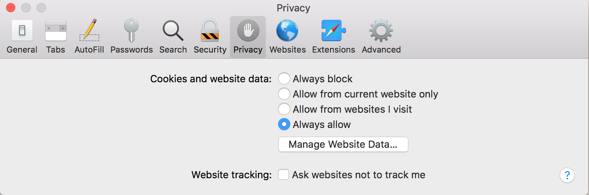

# （旧版）跟踪预防评估 — Apple Safari {#tracking-prevention-assessment-apple-safari}

>[!NOTE]
>
>此页面上的内容仅供参考。 使用此API需要来自Adobe的当前许可证。 不允许未经授权使用。

>[!IMPORTANT]
>
> 确保随时了解汇总在[产品公告](/help/authentication/product-announcements.md)页中的最新Adobe Pass身份验证产品公告和停用时间表。

## Safari 10 {#safari10}

**详细信息**

从Safari 10开始，默认的浏览器隐私设置将导致单点登录(SSO)、单点注销(SLO)和被动身份验证功能停止工作。 单点登录(SSO)和被动身份验证在中也无法工作
多个选项卡或浏览器窗口之间的同一会话。

这些更改会影响，并且正在影响Adobe Pass身份验证流程
对于AccessEnabler JavaScript SDK的以下版本：v2（版本2.x）、v3（版本3.x）、v4（版本4.x）。

### 缓解 {#mitigation-safari10}

为了减轻这些限制，您可以指示用户更改Safari 10浏览器隐私设置，并对浏览器“首选项”中“隐私”选项卡上的“**Cookie和网站数据**”条目使用“**始终允许**”选项，如下图所示。

## Safari 11 {#safari11}

**详细信息**

>[!IMPORTANT]
>
>Safari 10部分的所有上述详细信息仍然适用于Safari 11。

从Safari 11开始，浏览器引入了[智能防跟踪](https://webkit.org/blog/7675/intelligent-tracking-prevention/)(ITP)机制，这是一种使用启发式技术防止跨站点跟踪的技术。 这些启发式方法会影响在网络调用中存储和重播第三方Cookie的方式，这意味着根据ITP机制激活，Safari浏览器将在客户端 — 服务器模型通信中阻止第三方Cookie。

Adobe Pass身份验证服务使用并依赖于Cookie作为身份验证过程&#x200B;**的一部分以便正常工作**。 在身份验证过程自动发生（例如，临时通过）或使用iFrame或“无刷新”功能的实施中，Adobe的Cookie被视为第三方Cookie，默认情况下会被阻止。 对于任何其他情况，Safari都使用机器学习算法，该算法可能会将所有Adobe的Pass Authentication服务Cookie标记为跟踪Cookie，因此可能会受到ITP的阻止。

总之，在激活智能防跟踪(ITP)机制后，Safari 11浏览器的用户可能无法在启用了Adobe Pass身份验证的网站上进行身份验证，尤其是当用户使用多个启用了Adobe Pass身份验证的网站时。 因此，用户的身份验证体验可能是意外的，并且未定义，从无法登录到身份验证持续时间短于预期不等。

这些更改会影响Adobe Pass身份验证过程，并且正在影响以下版本的JavaScript SDK：v2（版本2.x）、v3（版本3.x）。

### 缓解 {#mitigation-safari11}

对于AccessEnabler JavaScript SDK v3（版本3.x）和AccessEnabler JavaScript SDK v4（版本4.x），该库都包含一个机制，该机制能够识别由于缺少所需的Cookie而导致用户身份验证被阻止的情况。 在这些情况下，库将触发特定的错误回调[N130](/help/authentication/integration-guide-programmers/legacy/error-reporting/error-reporting.md#advanced-error-codes-reference)，该回调将传递回已启用Adobe Pass身份验证的网站，以便用作指示用户采取可缓解此问题的操作的信号。 为了受益于此机制，网站必须实施[错误报告](/help/authentication/integration-guide-programmers/legacy/error-reporting/error-reporting.md)规范。

对于AccessEnabler JavaScript SDK v2（版本2.x），库不提供上述机制，因此，在指示用户采取措施缓解问题时，无法发出启用Adobe Pass身份验证的网站的信号。

可以缓解上述问题的操作列表&#x200B;**适用于所有三个版本的**&#x200B;的AccessEnabler JavaScript SDK。

当实施者的网站收到[N130](/help/authentication/integration-guide-programmers/legacy/error-reporting/error-reporting.md#advanced-error-codes-reference)错误回调时，应指示用户禁用智能防跟踪(ITP)并通过以下方式启用第三方Cookie：

* 对于Mac OS X High Sierra及更高版本：从“首选项”取消选中浏览器“隐私”选项卡中“**网站跟踪**”条目的“**阻止跨站点跟踪**”选项，如下图所示。

  

* 对于Mac OS X Sierra和之前的版本：从首选项的浏览器“隐私”选项卡中选中“**Cookie和网站数据**”条目的“**始终允许**”选项，如下图所示。

  

## Safari 12 {#safari12}

**详细信息**

>[!IMPORTANT]
>
>Safari 10部分和Safari 11部分的所有上述详细信息仍然适用于Safari 12。

本节详细介绍Safari 12上&#x200B;**AccessEnabler JavaScript SDK版本4.x**&#x200B;的兼容性问题。

>[!NOTE]
>
>请记住，对于AccessEnabler JavaScript SDK版本2.x和AccessEnabler JavaScript SDK版本3.x，它们都使用第三方Cookie进行身份验证过程，并且由于从Safari 11开始的ITP和第三方Cookie策略，用户的身份验证体验可能是意外的，并且未定义，从无法登录到比预期的身份验证持续时间更短。

### Safari 12上AccessEnabler JavaScript SDK v4（版本4.x）的认证功能 {#certified-functionality-of-accessenabler-javacscript=sdk-v4}

**使用用户交互的**&#x200B;身份验证流将始终有效，即使用户的浏览器禁用了第三方Cookie，因为从4.0版开始，AccessEnabler JavaScript SDK不再将第三方Cookie用于身份验证过程。

>[!NOTE]
>
>用户必须与站点交互才能打开登录弹出窗口和/或与MVPD登录页面交互。

**授权/预检/用户元数据**&#x200B;操作完全有效，前提是用户已经过身份验证。

### Safari 12上AccessEnabler JavaScript SDK v4（版本4.x）的已知问题 {#known-issues-of-accessenabler-javascript-sdk-4}

* SSO和SLO

   * 由于从Safari 10开始在Safari中实施localStorage的方式，JS SDK无法再通过公共域iFrame共享登录状态。 这意味着用户需要登录使用AccessEnabler JavaScript SDK的每个网站。 注销也不会删除网站之间的身份验证令牌，因此用户需要从每个启用Adobe Pass身份验证的网站注销。

* 临时传递

   * 对于临时传递，AccessEnabler JavaScript SDK使用个性化机制，以将身份验证令牌锁定到特定设备（浏览器实例）。 由于Safari 12中设计用于防止跟踪的新机制，因此我们正在计算并在个性化机制&#x200B;**中使用的指纹对于具有相同IP地址**&#x200B;的所有用户都将相同。 出于个性化目的，我们的确会考虑客户端IP，但即使这样，这种影响也会影响共享同一公共IP地址的用户。 对于这些用户，我们将计算相同的个性化ID，并且临时密码将绑定到该ID。 这意味着，一旦此类用户使用临时通行证，则任何其他用户都将无权访问它\！ 这尤其会对公司用户、教育机构或其他任何组织造成影响，这些组织有多个用户使用NAT或公共代理来访问Internet。

>[!NOTE]
>
>仅当实施者使用临时传递作为用户交互的结果时，此问题才会影响用户，否则，临时传递身份验证受以下&#x200B;**自动流**&#x200B;的约束。

* 自动流量

   * 在使用JS SDK 4.0时，如果尝试在自动模式下进行身份验证并且没有进行任何用户交互，则在Safari 12中将不会成功。请注意，即将推出的JS SDK 4.1修复了自动流的所有问题。

受此问题影响的用例：

* 自动TempPass（自由预览）身份验证 — 对于此类流，SDK将引发N130错误。

* 被动身份验证（静默失败） — 要求用户选择此MVPD并输入凭据

### 缓解 {#mitigation-safari12}

**SSO和SLO**

在撰写本文时，没有已知的缓解措施可用或可能。 Apple确实在Safari 12 (`https://webkit.org/blog/8124/introducing-storage-access-api`)中引入了“Storage Access API”，但当前实现不适用于localStorage，而仅适用于Cookie。 此外，API需要用户交互才能使用，并且在您使用它后，还会提示用户一个权限对话框，类似于以下对话框。

此时，这些Safari要求/提示与我们的UX要求不一致，并且我们在其他浏览器上的行为也不一致，在这些浏览器中，一旦我们在公共域localStorage中保存了令牌，SSO“刚刚起效”。

**临时传递**

为了缓解个性化问题并让用户进行交互，我们建议您以交互方式使用&#x200B;**[促销临时密码](/help/authentication/integration-guide-programmers/features-premium/temporary-access/temp-pass-feature.md#promotional-temp-pass)**，并提供至少一个有关用户的附加信息（例如电子邮件地址）。

## Safari 13 {#safari13}

**详细信息**

>[!IMPORTANT]
>
>从Safari 10部分到Safari 12部分的所有上述详细信息仍然适用于Safari 13。

从Safari 13开始，浏览器引入了[智能防跟踪](https://webkit.org/blog/7675/intelligent-tracking-prevention/) (ITP)的新更改，使得在将第三方Cookie标记为跟踪Cookie的过程中机制背后的启发式更严格，以防止跨站点跟踪。

如前几节所述，当实施者使用AccessEnabler JavaScript SDK v2（版本2.x）和AccessEnabler JavaScript SDK v3（版本3.x）时，Adobe Pass身份验证服务使用并依赖第三方Cookie作为身份验证过程的一部分。 与Safari浏览器的先前版本相比，在ITP花了一段时间才加入“了解”用户与有关各方之间的交互(程序员的网站和Adobe)时，Safari 13浏览器从一开始就阻止第三方Cookie，这被视为在客户端 — 服务器模型通信中跟踪Cookie。

总之，Safari 13浏览器的用户极有可能无法在启用了Adobe Pass身份验证的网站上启动新的身份验证，该网站使用的是旧版AccessEnabler JavaScript SDK v2（版本2.x）或v3（版本3.x）。 出现这种情况的原因是，ITP阻止了所有必需的AdobePrimetime身份验证服务Cookie，从而导致服务无法满足身份验证请求。

AccessEnabler JavaScript SDK v4（版本4.x）库不使用第三方Cookie进行身份验证，因此其操作不会以任何方式受到Safari 13更改的影响。

### 缓解 {#mitigation-safari13}

首先，我们强烈建议将&#x200B;**迁移到AccessEnabler JavaScript SDK版本4.x**，以便在Safari浏览器上拥有稳定且可预测的行为。

其次，对于AccessEnabler JavaScript SDK v3（3.x版），该库包含一种机制，能够识别由于缺少所需的Cookie而阻止用户身份验证的情况。 在这些情况下，库会触发一个特定的错误回调([N130](/help/authentication/integration-guide-programmers/legacy/error-reporting/error-reporting.md#advanced-error-codes-reference))，该回调将传递回启用Adobe Pass身份验证的网站，以便用作指示用户执行可缓解此问题的操作的信号。 为了受益于此机制，网站必须实施[错误报告](/help/authentication/integration-guide-programmers/legacy/error-reporting/error-reporting.md)规范。

对于AccessEnabler JavaScript SDK v2（版本2.x），库不提供上述机制，因此，在指示用户采取措施缓解问题时，无法发出启用Adobe Pass身份验证的网站的信号。

当实施者的网站收到[N130](/help/authentication/integration-guide-programmers/legacy/error-reporting/error-reporting.md#advanced-error-codes-reference)错误回调时，应指示用户禁用智能防跟踪(ITP)并通过以下方式启用第三方Cookie：

* 对于Mac OS X High Sierra及更高版本：从“首选项”取消选中浏览器“隐私”选项卡中“**网站跟踪**”条目的“**阻止跨站点跟踪**”选项，如下图所示。

  

* 对于Mac OS X Sierra和之前的版本：选中“首选项”下浏览器“隐私”选项卡中的“**Cookie和网站数据**”项的“**始终允许**”选项，如下图所示。

  
