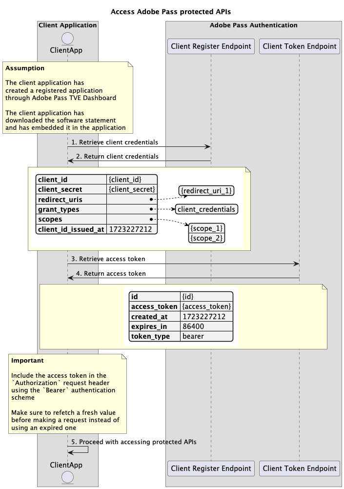

# 动态客户端注册流程 {#dynamic-client-registration-flow}

>[!IMPORTANT]
>
> 此页面上的内容仅供参考。 使用此API需要来自Adobe的当前许可证。 不允许未经授权使用。

>[!IMPORTANT]
>
> 动态客户端注册API实现受[限制机制](/help/authentication/integration-guide-programmers/throttling-mechanism.md)文档限制。

## 访问Adobe Pass保护的API {#access-adobe-pass-protected-apis}

### 先决条件 {#prerequisites-access-adobe-pass-protected-apis}

在访问Adobe Pass保护的API之前，请确保满足以下先决条件：

* 客户端代表必须按照[管理已注册的应用程序](../dynamic-client-registration-overview.md#manage-registered-applications)部分中的说明创建已注册的应用程序。
* 客户端代表必须下载并嵌入软件语句，如[管理软件语句](../dynamic-client-registration-overview.md#manage-software-statements)部分中所述。

>[!IMPORTANT]
>
> Adobe Pass身份验证SDK负责代表客户端应用程序获取和刷新客户端凭据和访问令牌。
> 
> 对于所有其他受Adobe Pass保护的API，客户端应用程序必须遵循以下工作流程。

### 工作流 {#workflow-access-adobe-pass-protected-apis}

按照下图所示的给定步骤访问受Adobe Pass保护的API。

*访问Adobe Pass保护的API*

1. **检索客户端凭据：**&#x200B;客户端应用程序通过调用客户端注册终结点，收集检索客户端凭据所需的所有数据。

   >[!IMPORTANT]
   >
   > 有关以下内容的详细信息，请参阅[检索客户端凭据](../apis/dynamic-client-registration-apis-retrieve-client-credentials.md#request) API文档：
   >
   > * 所有&#x200B;_必需的_&#x200B;参数，如`software_statement`
   > * 所有&#x200B;_必需的_&#x200B;标头，如`Content-Type`、`X-Device-Info`
   > * 所有&#x200B;_可选_&#x200B;参数和标头

1. **返回客户端凭据：**&#x200B;客户端注册终结点响应包含有关与接收的参数和标头关联的客户端凭据的信息。

   >[!IMPORTANT]
   >
   > 有关客户端凭据响应中提供的信息的详细信息，请参阅[检索客户端凭据](../apis/dynamic-client-registration-apis-retrieve-client-credentials.md#success) API文档。
   >
   >  
   >
   > Client Register验证请求数据，以确保满足基本条件：
   >
   > * _必需_&#x200B;参数和标头必须有效。
   >
   >  
   >
   > 如果验证失败，将生成错误响应，提供附加信息以遵守[检索客户端凭据](../apis/dynamic-client-registration-apis-retrieve-client-credentials.md#error) API文档。

   >[!TIP]
   >
   > 必须缓存并无限期使用客户端凭据。

1. **检索访问令牌：**&#x200B;客户端应用程序通过调用客户端令牌终结点，收集检索访问令牌所需的所有数据。

   >[!IMPORTANT]
   >
   > 有关以下内容的详细信息，请参阅[检索访问令牌](../apis/dynamic-client-registration-apis-retrieve-access-token.md#request) API文档：
   >
   > * 所有&#x200B;_必需的_&#x200B;参数，如`client_id`、`client_secret`和`grant_type`
   > * 所有&#x200B;_必需的_&#x200B;标头，如`Content-Type`、`X-Device-Info`
   > * 所有&#x200B;_可选_&#x200B;参数和标头

1. **返回访问令牌：**&#x200B;客户端令牌终结点响应包含有关与收到的参数和标头关联的访问令牌的信息。

   >[!IMPORTANT]
   >
   > 有关访问令牌响应中提供的信息的详细信息，请参阅[检索访问令牌](../apis/dynamic-client-registration-apis-retrieve-access-token.md#success) API文档。
   >
   >  
   >
   > 客户端令牌验证请求数据，以确保满足基本条件：
   >
   > * _必需_&#x200B;参数和标头必须有效。
   >
   >  
   >
   > 如果验证失败，将生成错误响应，提供附加信息以遵守[检索访问令牌](../apis/dynamic-client-registration-apis-retrieve-access-token.md#error) API文档。

   >[!TIP]
   >
   > 访问令牌必须仅在指定的时间内（例如，24小时存留期）缓存和使用。 过期后，客户端应用程序必须请求新的访问令牌。

1. **继续访问受保护的API：**&#x200B;客户端应用程序使用访问令牌访问其他受Adobe Pass保护的API。 客户端应用程序必须在使用`Authorization`身份验证方案（即`Bearer`）的`Authorization: Bearer <access_token>`请求标头中包含访问令牌。

   >[!IMPORTANT]
   >
   > 受Adobe Pass保护的API验证访问令牌，以确保满足基本条件：
   >
   > * _access_token_&#x200B;必须有效。
   > * _access_token_&#x200B;必须与有效的&#x200B;_client_id_&#x200B;和&#x200B;_client_secret_&#x200B;关联。
   > * _access_token_&#x200B;必须与有效的&#x200B;_software_statement_&#x200B;关联。
   >
   >  
   >
   > 如果验证失败，将生成错误响应，提供附加信息以遵守[增强型错误代码](../../../features-standard/error-reporting/enhanced-error-codes.md)文档。
