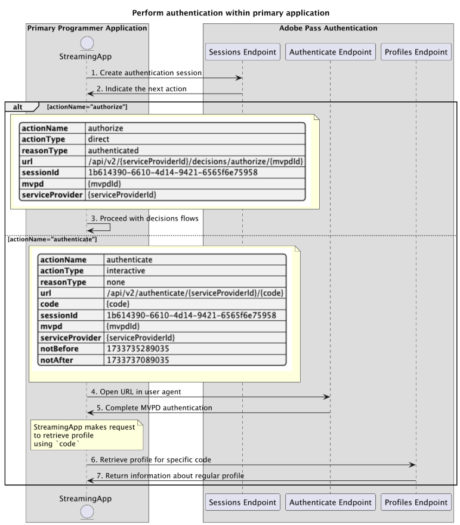

# 在主应用程序中执行的基本身份验证流程 {#basic-authentication-flow-performed-within-primary-application}

>[!IMPORTANT]
>
> 此页面上的内容仅供参考。 使用此API需要来自Adobe的当前许可证。 不允许未经授权使用。

>[!IMPORTANT]
>
> REST API V2实施受[限制机制](/help/authentication/integration-guide-programmers/throttling-mechanism.md)文档限制。

Adobe Pass身份验证权利内的&#x200B;**身份验证流**&#x200B;允许流式应用程序验证用户是否拥有有效的MVPD帐户。 此过程要求用户具有活动的MVPD帐户，并在MVPD登录页上输入有效的登录凭据。

在以下情况下需要验证流程：

* 用户首次打开应用程序时。
* 用户以前的身份验证过期时。
* 用户从MVPD帐户注销时。
* 当用户希望使用其他MVPD进行身份验证时。

在所有这些情况下，调用任何配置文件端点的应用程序都会收到空响应或一个或多个配置文件，但目标对象是不同的MVPD。

**身份验证流**&#x200B;需要用户代理（浏览器）完成从应用程序到Adobe Pass后端，然后到MVPD登录页面，最后返回到应用程序的一系列调用。 此流程可能包括到MVPD系统的多个重定向以及管理为每个域存储的Cookie或会话，如果没有用户代理，实现这些重定向和会话将是非常困难的。

基于支持用户交互以选择MVPD并在用户代理中使用所选MVPD进行验证的主应用程序（流应用程序）功能，验证方案包括：

* [在主应用程序中执行身份验证](./rest-api-v2-basic-authentication-primary-application-flow.md)
* [使用预选的mvpd在辅助应用程序中执行身份验证](rest-api-v2-basic-authentication-secondary-application-flow.md)
* [无需预选mvpd就可在辅助应用程序中执行身份验证](rest-api-v2-basic-authentication-secondary-application-flow.md)

## 在主应用程序中执行身份验证 {#perform-authentication-within-primary-application}

### 先决条件 {#prerequisites-perform-authentication-within-primary-application}

在通过主应用程序内的用户交互执行身份验证之前，请确保满足以下先决条件：

* 流应用程序必须选择一个MVPD。
* 流应用程序必须启动身份验证会话，才能使用选定的MVPD登录。
* 流应用程序必须在用户代理中使用选定的MVPD进行身份验证。

>[!IMPORTANT]
>
> 假设
>
>  
> 
> * 流应用程序支持用户交互以选择MVPD。
> * 流应用程序支持用户交互以在用户代理中与所选MVPD进行身份验证。

### 工作流 {#workflow-perform-authentication-completed-on-primary-application}

按照给定的步骤实施在主应用程序中执行的基本身份验证流程，如下图所示。

*在主应用程序中执行身份验证*

1. **创建身份验证会话：**&#x200B;流应用程序通过调用会话终结点来收集启动身份验证会话所需的所有数据。

   >[!IMPORTANT]
   >
   > 有关以下内容的详细信息，请参阅[创建身份验证会话](../../apis/sessions-apis/rest-api-v2-sessions-apis-create-authentication-session.md) API文档：
   > 
   > * 所有&#x200B;_必需的_&#x200B;参数，如`serviceProvider`、`mvpd`、`domainName`和`redirectUrl`
   > * 所有&#x200B;_必需的_&#x200B;标头，如`Authorization`、`AP-Device-Identifier`
   > * 所有&#x200B;_可选_&#x200B;参数和标头
   > 
   >  
   > 
   > 创建身份验证会话时，流应用程序必须在单个调用中提供所有必需的参数。

1. **指示下一个操作：**&#x200B;会话终结点响应包含指导流应用程序执行下一个操作所需的数据。

   >[!IMPORTANT]
   >
   > 有关会话响应中提供的信息的详细信息，请参阅[创建身份验证会话](../../apis/sessions-apis/rest-api-v2-sessions-apis-create-authentication-session.md) API文档。
   > 
   >  
   > 
   > 会话端点验证请求数据以确保满足基本条件：
   >
   > * _必需_&#x200B;参数和标头必须有效。
   > * 提供的`serviceProvider`和`mvpd`之间的集成必须处于活动状态。
   > 
   >  
   > 
   > 如果验证失败，将生成错误响应，提供附加信息以遵守[增强型错误代码](../../../../features-standard/error-reporting/enhanced-error-codes.md)文档。

1. **继续决策流：**&#x200B;会话终结点响应包含以下数据：
   * `actionName`属性设置为“授权”。
   * `actionType`属性设置为“直接”。

   如果Adobe Pass后端标识有效的配置文件，则流应用程序无需使用选定的MVPD重新进行身份验证，因为已存在可用于后续决策流的配置文件。

1. **在用户代理中打开URL：**&#x200B;会话终结点响应包含以下数据：
   * `url`可用于在MVPD登录页中启动交互式身份验证。
   * `actionName`属性设置为“身份验证”。
   * `actionType`属性设置为“交互式”。

   如果Adobe Pass后端未识别有效的配置文件，则流应用程序将打开用户代理以加载提供的`url`，并向身份验证端点发出请求。 此流程可能包括多次重定向，最终将用户引导至MVPD登录页面并提供有效凭据。

1. **完成MVPD身份验证：**&#x200B;如果身份验证流程成功，用户代理交互将在Adobe Pass后端保存常规配置文件并到达提供的`redirectUrl`。

1. **检索特定代码的配置文件：**&#x200B;流应用程序通过向“配置文件”端点发送请求，收集检索配置文件信息所需的所有数据。

   >[!IMPORTANT]
   >
   > 有关以下内容的详细信息，请参阅[检索特定代码](../../apis/profiles-apis/rest-api-v2-profiles-apis-retrieve-profile-for-specific-code.md) API的配置文件：
   >
   > * 所有&#x200B;_必需的_&#x200B;参数，如`serviceProvider`、`code`
   > * 所有&#x200B;_必需的_&#x200B;标头，如`Authorization`、`AP-Device-Identifier`
   > * 所有&#x200B;_可选_&#x200B;参数和标头

   >[!TIP]
   >
   > 建议：流应用程序可以等待用户代理到达提供的`redirectUrl`，以检查是否已成功生成并保存常规配置文件。

1. **返回有关常规配置文件的信息：**&#x200B;配置文件终结点响应包含有关与收到的参数和标头关联的常规配置文件的信息。

   >[!IMPORTANT]
   >
   > 有关配置文件响应中提供的信息的详细信息，请参阅[检索特定代码](../../apis/profiles-apis/rest-api-v2-profiles-apis-retrieve-profile-for-specific-code.md) API的配置文件。
   > 
   >  
   > 
   > 配置文件端点验证请求数据，以确保满足基本条件：
   >
   > * _必需_&#x200B;参数和标头必须有效。
   >
   >  
   > 
   > 如果验证失败，将生成错误响应，提供附加信息以遵守[增强型错误代码](../../../../features-standard/error-reporting/enhanced-error-codes.md)文档。
