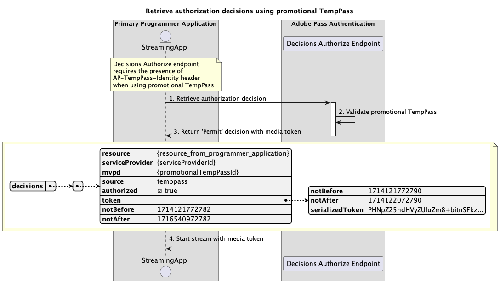

# 临时访问流 {#temporary-access-flows}

>[!IMPORTANT]
>
> 此页面上的内容仅供参考。 使用此API需要来自Adobe的当前许可证。 不允许未经授权使用。

>[!IMPORTANT]
>
> REST API V2实施受[限制机制](/help/authentication/integration-guide-programmers/throttling-mechanism.md)文档限制。

TempPass允许程序员提供对其受保护内容的临时访问，而无需要求用户使用有效的MVPD帐户进行身份验证。

有关TempPass功能的更多详细信息，请参阅[TempPass](../../../../features-premium/temporary-access/temp-pass.md)文档。

临时访问流允许您查询以下方案：

* [使用基本TempPass检索授权决策](#retrieve-authorization-decisions-using-basic-temppass)
* [使用促销临时传递检索授权决策](#retrieve-authorization-decisions-using-promotional-temppass)
* [使用促销临时传递消耗最大数量的资源](#consume-maximum-number-of-resources-using-promotional-temppass)
* [在基本或促销TempPass过期时检索授权决策](#retrieve-authorization-decisions-when-basic-or-promotional-temppass-expires)
* [检索基本临时传递的配置文件](#retrieve-profile-for-basic-temppass)
* [检索促销TempPass的配置文件](#retrieve-profile-for-promotional-temppass)

## 使用基本TempPass检索授权决策 {#retrieve-authorization-decisions-using-basic-temppass}

### 先决条件 {#prerequisites-retrieve-authorization-decisions-using-basic-temppass}

在使用基本TempPass检索授权决策之前，请确保满足以下先决条件：

* 流应用程序希望提供播放内容的临时访问权限，而不要求用户进行身份验证。
* 流应用程序必须先检索授权决策，然后才能播放用户选择的资源。

>[!IMPORTANT]
>
> 假设
> 
>  
> 
> * 必须应用基本TempPass的有效配置设置才能将提供的`serviceProvider`和`mvpd`之间的集成应用于该集成。
> * 为基本TempPass配置的生存时间(TTL)尚未过期。

### 工作流 {#workflow-retrieve-authorization-decisions-using-basic-temppass}

按照给定的步骤，使用基本的TempPass实施授权流，如下图所示。

*使用基本TempPass检索授权决策*

1. **检索授权决定：**&#x200B;流应用程序通过调用Decisions Authorize终结点，收集所有必需的数据以获取特定资源的授权决定。

   >[!IMPORTANT]
   >
   > 有关以下各项的详细信息，请参阅使用特定mvpd](../../apis/decisions-apis/rest-api-v2-decisions-apis-retrieve-authorization-decisions-using-specific-mvpd.md) API检索[授权决策：
   > 
   > * 所有&#x200B;_必需的_&#x200B;参数，如`serviceProvider`、`mvpd`和`resources`
   > * 所有&#x200B;_必需的_&#x200B;标头，如`Authorization`和`AP-Device-Identifier`
   > * 所有&#x200B;_可选_&#x200B;参数和标头

1. **验证basic TempPass：** Adobe Pass服务器验证是否对提供的`serviceProvider`和`mvpd`之间的集成应用了basic TempPass的有效配置设置。

1. **返回具有媒体令牌的`Permit`决策：**&#x200B;决策授权终结点响应包含`Permit`决策和媒体令牌。

   >[!IMPORTANT]
   >
   > 有关决策响应中提供的信息的详细信息，请参阅使用特定mvpd](../../apis/decisions-apis/rest-api-v2-decisions-apis-retrieve-authorization-decisions-using-specific-mvpd.md) API检索[授权决策。
   >
   >  
   > 
   > Decisions Authorize端点验证请求数据以确保满足基本条件：
   >
   > * _必需_&#x200B;参数和标头必须有效。
   > * 提供的`serviceProvider`和`mvpd`之间的集成必须处于活动状态。
   >
   >  
   > 
   > 如果基本验证失败，将生成错误响应，提供附加信息，这些信息将遵循[增强型错误代码](../../../../features-standard/error-reporting/enhanced-error-codes.md)文档。
   >
   >  
   > 
   > Decisions Authorize端点使用请求数据检查是否满足临时访问条件：
   >
   > * 为基本TempPass配置的生存时间(TTL)不得过期。
   >
   >  
   > 
   > 如果临时访问验证失败，将生成错误响应，提供附加信息，这些信息将遵循[增强型错误代码](../../../../features-standard/error-reporting/enhanced-error-codes.md)文档。

1. **使用媒体令牌启动流：**&#x200B;流应用程序使用媒体令牌播放内容。

## 使用促销临时传递检索授权决策 {#retrieve-authorization-decisions-using-promotional-temppass}

### 先决条件 {#prerequisites-retrieve-authorization-decisions-using-promotional-temppass}

在使用提升TempPass检索授权决策之前，请确保满足以下先决条件：

* 流应用程序希望提供临时访问以播放最大数量的资源，而不要求用户进行身份验证。
* 流应用程序在检索授权决策时必须包含有关用户身份的唯一信息。
* 流应用程序必须先检索授权决策，然后才能播放用户选择的资源。

>[!IMPORTANT]
>
> 假设
>
>  
> 
> * 必须对提供的`serviceProvider`和`mvpd`之间的集成应用促销TempPass的有效配置设置。
> * 为提升TempPass配置的生存时间(TTL)尚未过期。
> * 尚未使用为提升TempPass配置的最大资源数。

### 工作流 {#workflow-retrieve-authorization-decisions-using-promotional-temppass}

按照给定的步骤使用提升TempPass实施授权流，如下图所示。

*使用提升TempPass检索授权决策*

1. **检索授权决定：**&#x200B;流应用程序通过调用Decisions Authorize终结点，收集所有必需的数据以获取特定资源的授权决定。

   >[!IMPORTANT]
   >
   > 有关以下各项的详细信息，请参阅使用特定mvpd](../../apis/decisions-apis/rest-api-v2-decisions-apis-retrieve-authorization-decisions-using-specific-mvpd.md) API检索[授权决策：
   >
   > * 所有&#x200B;_必需的_&#x200B;参数，如`serviceProvider`、`mvpd`和`resources`
   > * 所有&#x200B;_必需的_&#x200B;标头，如`Authorization`和`AP-Device-Identifier`
   > * 所有&#x200B;_可选_&#x200B;参数和标头
   >
   >  
   >
   > 使用促销TempPass时，决策授权端点要求存在`AP-TempPass-Identity`标头。 标头包含有关访问内容的用户的身份的唯一信息。
   > 
   >  
   > 
   > 有关`AP-TempPass-Identity`标头的更多详细信息，请参阅[AP-TempPass-Identity](../../appendix/headers/rest-api-v2-appendix-headers-ap-temppass-identity.md)文档。

1. **验证提升TempPass：** Adobe Pass服务器验证是否对提供的`serviceProvider`和`mvpd`之间的集成应用了提升TempPass的有效配置设置。

1. **返回具有媒体令牌的`Permit`决策：**&#x200B;决策授权终结点响应包含`Permit`决策和媒体令牌。

   >[!IMPORTANT]
   >
   > 有关决策响应中提供的信息的详细信息，请参阅使用特定mvpd](../../apis/decisions-apis/rest-api-v2-decisions-apis-retrieve-authorization-decisions-using-specific-mvpd.md) API检索[授权决策。
   > 
   >  
   > 
   > Decisions Authorize端点验证请求数据以确保满足基本条件：
   >
   > * _必需_&#x200B;参数和标头必须有效。
   > * 提供的`serviceProvider`和`mvpd`之间的集成必须处于活动状态。
   >
   >  
   > 
   > 如果基本验证失败，将生成错误响应，提供附加信息，这些信息将遵循[增强型错误代码](../../../../features-standard/error-reporting/enhanced-error-codes.md)文档。
   >
   >  
   > 
   > Decisions Authorize端点使用请求数据检查是否满足临时访问条件：
   >
   > * 为提升TempPass配置的生存时间(TTL)不得过期。
   > * 不得使用为提升TempPass配置的最大资源数。
   >
   >  
   > 
   > 如果临时访问验证失败，将生成错误响应，提供附加信息，这些信息将遵循[增强型错误代码](../../../../features-standard/error-reporting/enhanced-error-codes.md)文档。

1. **使用媒体令牌启动流：**&#x200B;流应用程序使用媒体令牌播放内容。

## 使用促销临时传递消耗最大数量的资源 {#consume-maximum-number-of-resources-using-promotional-temppass}

### 先决条件 {#prerequisites-consume-maximum-number-of-resources-using-promotional-temppass}

在使用提升TempPass使用最大数量的资源之前，请确保满足以下先决条件：

* 流应用程序希望提供临时访问以播放最大数量的资源，而不要求用户进行身份验证。
* 流应用程序在检索授权决策时必须包含有关用户身份的唯一信息。
* 流应用程序必须先检索授权决策，然后才能播放用户选择的资源。

>[!IMPORTANT]
>
> 假设
>
>  
> 
> * 必须对提供的`serviceProvider`和`mvpd`之间的集成应用促销TempPass的有效配置设置。
> * 为提升TempPass配置的生存时间(TTL)尚未过期。
> * 为提升临时传递配置的最大资源数为1。

### 工作流 {#workflow-consume-maximum-number-of-resources-using-promotional-temppass}

使用提升TempPass消耗最大数量的资源时，请按照给定的步骤实施授权流，如下图所示。

*使用提升TempPass使用最大数量的资源*

1. **检索促销TempPass的配置文件：**&#x200B;流式应用程序通过向“配置文件”端点发送请求，收集检索促销TempPass的配置文件信息所需的所有数据。

   >[!IMPORTANT]
   >
   > 有关以下内容的详细信息，请参阅特定mvpd ](../../apis/profiles-apis/rest-api-v2-profiles-apis-retrieve-profile-for-specific-mvpd.md) API的[检索配置文件：
   >
   > * 所有&#x200B;_必需的_&#x200B;参数，如`serviceProvider`和`mvpd`
   > * 所有&#x200B;_必需的_&#x200B;标头，如`Authorization`和`AP-Device-Identifier`
   > * 所有&#x200B;_可选_&#x200B;参数和标头
   >
   >  
   > 
   > 配置文件端点查询是可选的，可用于确定使用提升TempPass仍可以播放多少资源。

1. **验证提升TempPass：** Adobe Pass服务器验证是否对提供的`serviceProvider`和`mvpd`之间的集成应用了提升TempPass的有效配置设置。

1. **返回有关临时配置文件的信息：**&#x200B;配置文件终结点响应包含有关临时配置文件的信息，包括设置为“临时”的属性`type`。

   >[!IMPORTANT]
   >
   > 有关配置文件响应中提供的信息的详细信息，请参阅特定mvpd ](../../apis/profiles-apis/rest-api-v2-profiles-apis-retrieve-profile-for-specific-mvpd.md) API的[检索配置文件。
   > 
   >  
   > 
   > 配置文件端点验证请求数据，以确保满足基本条件：
   >
   > * _必需_&#x200B;参数和标头必须有效。
   > * 提供的`serviceProvider`和`mvpd`之间的集成必须处于活动状态。
   > 
   >  
   >
   > 如果基本验证失败，将生成错误响应，提供附加信息，这些信息将遵循[增强型错误代码](../../../../features-standard/error-reporting/enhanced-error-codes.md)文档。
   >
   >  
   > 
   > 配置文件端点使用请求数据检查是否满足临时访问条件：
   >
   > * 为提升TempPass配置的生存时间(TTL)不得过期。
   > * 不得使用为提升TempPass配置的最大资源数。
   >
   >  
   > 
   > 如果临时访问验证失败，将生成错误响应，提供附加信息，这些信息将遵循[增强型错误代码](../../../../features-standard/error-reporting/enhanced-error-codes.md)文档。

1. **继续决策流：**&#x200B;如果配置文件终结点响应包含配置文件，则流应用程序将使用临时配置文件信息继续后续决策流。

1. **检索授权决定：**&#x200B;流应用程序通过调用Decisions Authorize终结点，收集所有必需的数据以获取特定资源的授权决定。

   >[!IMPORTANT]
   > 
   > 有关以下各项的详细信息，请参阅使用特定mvpd](../../apis/decisions-apis/rest-api-v2-decisions-apis-retrieve-authorization-decisions-using-specific-mvpd.md) API检索[授权决策：
   >
   > * 所有&#x200B;_必需的_&#x200B;参数，如`serviceProvider`、`mvpd`和`resources`
   > * 所有&#x200B;_必需的_&#x200B;标头，如`Authorization`和`AP-Device-Identifier`
   > * 所有&#x200B;_可选_&#x200B;参数和标头
   >
   >  
   > 
   > 使用促销TempPass时，决策授权端点要求存在`AP-TempPass-Identity`标头。 标头包含有关访问内容的用户的身份的唯一信息。
   > 
   >  
   > 
   > 有关`AP-TempPass-Identity`标头的更多详细信息，请参阅[AP-TempPass-Identity](../../appendix/headers/rest-api-v2-appendix-headers-ap-temppass-identity.md)文档。

1. **验证提升TempPass：** Adobe Pass服务器验证是否对提供的`serviceProvider`和`mvpd`之间的集成应用了提升TempPass的有效配置设置。

1. **返回具有媒体令牌的`Permit`决策：**&#x200B;决策授权终结点响应包含`Permit`决策和媒体令牌。

   >[!IMPORTANT]
   >
   > 有关决策响应中提供的信息的详细信息，请参阅使用特定mvpd](../../apis/decisions-apis/rest-api-v2-decisions-apis-retrieve-authorization-decisions-using-specific-mvpd.md) API检索[授权决策。
   > 
   >  
   > 
   > Decisions Authorize端点验证请求数据以确保满足基本条件：
   >
   > * _必需_&#x200B;参数和标头必须有效。
   > * 提供的`serviceProvider`和`mvpd`之间的集成必须处于活动状态。
   >
   >  
   > 
   > 如果基本验证失败，将生成错误响应，提供附加信息，这些信息将遵循[增强型错误代码](../../../../features-standard/error-reporting/enhanced-error-codes.md)文档。
   > 
   >  
   > 
   > Decisions Authorize端点使用请求数据检查是否满足临时访问条件：
   >
   > * 为提升TempPass配置的生存时间(TTL)不得过期。
   > * 不得使用为提升TempPass配置的最大资源数。
   >
   >  
   > 
   > 如果临时访问验证失败，将生成错误响应，提供附加信息，这些信息将遵循[增强型错误代码](../../../../features-standard/error-reporting/enhanced-error-codes.md)文档。

1. **检索授权决定：**&#x200B;流应用程序通过调用Decisions Authorize终结点，收集所有必需的数据以获取特定资源的授权决定。

   >[!IMPORTANT]
   >
   > 有关以下各项的详细信息，请参阅使用特定mvpd](../../apis/decisions-apis/rest-api-v2-decisions-apis-retrieve-authorization-decisions-using-specific-mvpd.md) API检索[授权决策：
   >
   > * 所有&#x200B;_必需的_&#x200B;参数，如`serviceProvider`、`mvpd`和`resources`
   > * 所有&#x200B;_必需的_&#x200B;标头，如`Authorization`和`AP-Device-Identifier`
   > * 所有&#x200B;_可选_&#x200B;参数和标头
   >
   >  
   > 
   > 使用促销TempPass时，决策授权端点要求存在`AP-TempPass-Identity`标头。 标头包含有关访问内容的用户的身份的唯一信息。
   >
   >  
   > 
   > 有关`AP-TempPass-Identity`标头的更多详细信息，请参阅[AP-TempPass-Identity](../../appendix/headers/rest-api-v2-appendix-headers-ap-temppass-identity.md)文档。

1. **验证提升TempPass：** Adobe Pass服务器验证是否对提供的`serviceProvider`和`mvpd`之间的集成应用了提升TempPass的有效配置设置。

1. **返回包含详细信息的`Deny`决策：** Decisions Authorize终结点响应包含`Deny`决策和错误有效负载，该有效负载遵守[增强型错误代码](../../../../features-standard/error-reporting/enhanced-error-codes.md)文档。

   >[!IMPORTANT]
   >
   > 有关决策响应中提供的信息的详细信息，请参阅使用特定mvpd](../../apis/decisions-apis/rest-api-v2-decisions-apis-retrieve-authorization-decisions-using-specific-mvpd.md) API检索[授权决策。
   > 
   >  
   > 
   > Decisions Authorize端点验证请求数据以确保满足基本条件：
   >
   > * _必需_&#x200B;参数和标头必须有效。
   > * 提供的`serviceProvider`和`mvpd`之间的集成必须处于活动状态。
   >
   >  
   > 
   > 如果基本验证失败，将生成错误响应，提供附加信息，这些信息将遵循[增强型错误代码](../../../../features-standard/error-reporting/enhanced-error-codes.md)文档。
   >
   >  
   > 
   > Decisions Authorize端点使用请求数据检查是否满足临时访问条件：
   >
   > * 为提升TempPass配置的生存时间(TTL)不得过期。
   > * 不得使用为提升TempPass配置的最大资源数。
   >
   >  
   > 
   > 如果临时访问验证失败，将生成错误响应，提供附加信息，这些信息将遵循[增强型错误代码](../../../../features-standard/error-reporting/enhanced-error-codes.md)文档。

1. **处理`Deny`决策详细信息：**&#x200B;流式应用程序处理来自响应的错误信息，并可以使用它选择性地在用户界面上显示特定消息。

   >[!TIP]
   >
   > 建议：流应用程序可以通知用户已超过最大资源数，并通知用户使用常规MVPD启动基本验证流以继续观看。

## 在基本或促销TempPass过期时检索授权决策 {#retrieve-authorization-decisions-when-basic-or-promotional-temppass-expires}

### 先决条件 {#prerequisites-retrieve-authorization-decisions-when-basic-or-promotional-temppass-expires}

在基本或提升TempPass过期时检索授权决策之前，请确保满足以下先决条件：

* [使用基本TempPass检索授权决策之前的先决条件](#prerequisites-retrieve-authorization-decisions-using-basic-temppass)。
* [使用提升TempPass检索授权决策之前的先决条件](#prerequisites-retrieve-authorization-decisions-using-promotional-temppass)。

>[!IMPORTANT]
>
> 假设
> 
>  
> 
> * 必须有一个基本或提升TempPass的有效配置设置应用于提供的`serviceProvider`和`mvpd`之间的集成。
> * 为基本或促销配置的生存时间(TTL)已超过临时访问持续时间限制。

### 工作流 {#workflow-retrieve-authorization-decisions-when-basic-or-promotional-temppass-expires}

按照给定的步骤，在基本或提升TempPass过期时实施授权流，如下图所示。

*在基本或促销的TempPass过期时检索授权决策*

1. **检索授权决定：**&#x200B;流应用程序通过调用Decisions Authorize终结点，收集所有必需的数据以获取特定资源的授权决定。

   >[!IMPORTANT]
   >
   > 有关以下各项的详细信息，请参阅使用特定mvpd](../../apis/decisions-apis/rest-api-v2-decisions-apis-retrieve-authorization-decisions-using-specific-mvpd.md) API检索[授权决策：
   > 
   > * 所有&#x200B;_必需的_&#x200B;参数，如`serviceProvider`、`mvpd`和`resources`
   > * 所有&#x200B;_必需的_&#x200B;标头，如`Authorization`和`AP-Device-Identifier`
   > * 所有&#x200B;_可选_&#x200B;参数和标头
   >
   >  
   > 
   > 使用促销TempPass时，决策授权端点要求存在`AP-TempPass-Identity`标头。 标头包含有关访问内容的用户的身份的唯一信息。
   > 
   >  
   > 
   > 有关`AP-TempPass-Identity`标头的更多详细信息，请参阅[AP-TempPass-Identity](../../appendix/headers/rest-api-v2-appendix-headers-ap-temppass-identity.md)文档。

1. **验证基本或提升TempPass：** Adobe Pass服务器验证是否对提供的`serviceProvider`和`mvpd`之间的集成应用了基本或提升TempPass的有效配置设置。

1. **返回包含详细信息的`Deny`决策：** Decisions Authorize终结点响应包含`Deny`决策和错误有效负载，该有效负载遵守[增强型错误代码](../../../../features-standard/error-reporting/enhanced-error-codes.md)文档。

   >[!IMPORTANT]
   >
   > 有关决策响应中提供的信息的详细信息，请参阅使用特定mvpd](../../apis/decisions-apis/rest-api-v2-decisions-apis-retrieve-authorization-decisions-using-specific-mvpd.md) API检索[授权决策。
   > 
   >  
   > 
   > Decisions Authorize端点验证请求数据以确保满足基本条件：
   >
   > * _必需_&#x200B;参数和标头必须有效。
   > * 提供的`serviceProvider`和`mvpd`之间的集成必须处于活动状态。
   >
   >  
   > 
   > 如果基本验证失败，将生成错误响应，提供附加信息，这些信息将遵循[增强型错误代码](../../../../features-standard/error-reporting/enhanced-error-codes.md)文档。
   >
   >  
   > 
   > Decisions Authorize端点使用请求数据检查是否满足临时访问条件：
   >
   > * 为基本或提升TempPass配置的生存时间(TTL)不得过期。
   > * 不得使用为提升TempPass配置的最大资源数。
   >
   >  
   > 
   > 如果临时访问验证失败，将生成错误响应，提供附加信息，这些信息将遵循[增强型错误代码](../../../../features-standard/error-reporting/enhanced-error-codes.md)文档。

1. **处理`Deny`决策详细信息：**&#x200B;流式应用程序处理来自响应的错误信息，并可以使用它选择性地在用户界面上显示特定消息。

   >[!TIP]
   >
   > 建议：流应用程序可以通知用户临时访问已过期，并建议用户使用常规MVPD启动基本验证流程以继续观看。

## 检索基本临时传递的配置文件 {#retrieve-profile-for-basic-temppass}

>[!IMPORTANT]
>
> 配置文件端点查询对于基本TempPass是可选的。

### 先决条件 {#prerequisites-retrieve-profile-for-basic-temppass}

在检索基本TempPass的配置文件之前，请确保满足以下先决条件：

* 流应用程序希望检索临时配置文件，以确保临时访问未过期。

>[!IMPORTANT]
>
> 假设
> 
>  
> 
> * 必须应用基本TempPass的有效配置设置才能将提供的`serviceProvider`和`mvpd`之间的集成应用于该集成。
> * 为基本TempPass配置的生存时间(TTL)不得过期。

### 工作流 {#workflow-retrieve-profile-information-for-basic-temppass}

按照给定的步骤实施基本TempPass的配置文件检索流程，如下图所示。

*检索基本临时传递的配置文件*

1. **检索基本TempPass的配置文件：**&#x200B;流式应用程序通过向“配置文件”端点发送请求，收集检索基本TempPass的配置文件信息所需的所有数据。

   >[!IMPORTANT]
   >
   > 有关以下内容的详细信息，请参阅特定mvpd ](../../apis/profiles-apis/rest-api-v2-profiles-apis-retrieve-profile-for-specific-mvpd.md) API的[检索配置文件：
   > 
   > * 所有&#x200B;_必需的_&#x200B;参数，如`serviceProvider`和`mvpd`
   > * 所有&#x200B;_必需的_&#x200B;标头，如`Authorization`和`AP-Device-Identifier`
   > * 所有&#x200B;_可选_&#x200B;参数和标头

1. **验证basic TempPass：** Adobe Pass服务器验证是否对提供的`serviceProvider`和`mvpd`之间的集成应用了basic TempPass的有效配置设置。

1. **返回有关临时配置文件的信息：**&#x200B;配置文件终结点响应包含有关临时配置文件的信息，包括设置为“临时”的属性`type`。

   >[!IMPORTANT]
   >
   > 有关配置文件响应中提供的信息的详细信息，请参阅特定mvpd ](../../apis/profiles-apis/rest-api-v2-profiles-apis-retrieve-profile-for-specific-mvpd.md) API的[检索配置文件。
   > 
   >  
   > 
   > 配置文件端点验证请求数据，以确保满足基本条件：
   >
   > * _必需_&#x200B;参数和标头必须有效。
   > * 提供的`serviceProvider`和`mvpd`之间的集成必须处于活动状态。
   >
   >  
   > 
   > 如果基本验证失败，将生成错误响应，提供附加信息，这些信息将遵循[增强型错误代码](../../../../features-standard/error-reporting/enhanced-error-codes.md)文档。
   >
   >  
   > 
   > 配置文件端点使用请求数据检查是否满足临时访问条件：
   >
   > * 为基本TempPass配置的生存时间(TTL)不得过期。
   >
   >  
   > 
   > 如果临时访问验证失败，将生成错误响应，提供附加信息，这些信息将遵循[增强型错误代码](../../../../features-standard/error-reporting/enhanced-error-codes.md)文档。

1. **继续决策流：**&#x200B;如果配置文件终结点响应包含配置文件，则流应用程序将使用临时配置文件信息继续后续决策流。

## 检索促销TempPass的配置文件 {#retrieve-profile-for-promotional-temppass}

>[!IMPORTANT]
>
> 配置文件端点查询对于提升TempPass是可选的。

### 先决条件 {#prerequisites-retrieve-profile-for-promotional-temppass}

在检索提升TempPass的配置文件之前，请确保满足以下先决条件：

* 流应用程序想要检索临时配置文件，以确保临时访问未过期或确定仍可以播放多少资源。

>[!IMPORTANT]
>
> 假设
>
>  
> 
> * 必须对提供的`serviceProvider`和`mvpd`之间的集成应用促销TempPass的有效配置设置。
> * 为提升TempPass配置的生存时间(TTL)尚未过期。
> * 尚未使用为提升TempPass配置的最大资源数。

### 工作流 {#workflow-retrieve-profile-information-for-promotional-temppass}

按照给定的步骤实施提升TempPass的用户档案检索流程，如下图所示。

*检索促销TempPass的配置文件*

1. **检索促销TempPass的配置文件：**&#x200B;流式应用程序通过向“配置文件”端点发送请求，收集检索促销TempPass的配置文件信息所需的所有数据。

   >[!IMPORTANT]
   >
   > 有关以下内容的详细信息，请参阅特定mvpd ](../../apis/profiles-apis/rest-api-v2-profiles-apis-retrieve-profile-for-specific-mvpd.md) API的[检索配置文件：
   > 
   > * 所有&#x200B;_必需的_&#x200B;参数，如`serviceProvider`和`mvpd`
   > * 所有&#x200B;_必需的_&#x200B;标头，如`Authorization`和`AP-Device-Identifier`
   > * 所有&#x200B;_可选_&#x200B;参数和标头

1. **验证提升TempPass：** Adobe Pass服务器验证是否对提供的`serviceProvider`和`mvpd`之间的集成应用了提升TempPass的有效配置设置。

1. **返回有关临时配置文件的信息：**&#x200B;配置文件终结点响应包含有关临时配置文件的信息，包括设置为“临时”的属性`type`。

   >[!IMPORTANT]
   >
   > 有关配置文件响应中提供的信息的详细信息，请参阅特定mvpd ](../../apis/profiles-apis/rest-api-v2-profiles-apis-retrieve-profile-for-specific-mvpd.md) API的[检索配置文件。
   > 
   >  
   > 
   > 配置文件端点验证请求数据，以确保满足基本条件：
   >
   > * _必需_&#x200B;参数和标头必须有效。
   > * 提供的`serviceProvider`和`mvpd`之间的集成必须处于活动状态。
   >
   >  
   > 
   > 如果基本验证失败，将生成错误响应，提供附加信息，这些信息将遵循[增强型错误代码](../../../../features-standard/error-reporting/enhanced-error-codes.md)文档。
   >
   >  
   > 
   > 配置文件端点使用请求数据检查是否满足临时访问条件：
   >
   > * 为提升TempPass配置的生存时间(TTL)不得过期。
   > * 不得使用为提升TempPass配置的最大资源数。
   >
   >  
   > 
   > 如果临时访问验证失败，将生成错误响应，提供附加信息，这些信息将遵循[增强型错误代码](../../../../features-standard/error-reporting/enhanced-error-codes.md)文档。

1. **继续决策流：**&#x200B;如果配置文件终结点响应包含配置文件，则流应用程序将使用临时配置文件信息继续后续决策流。
