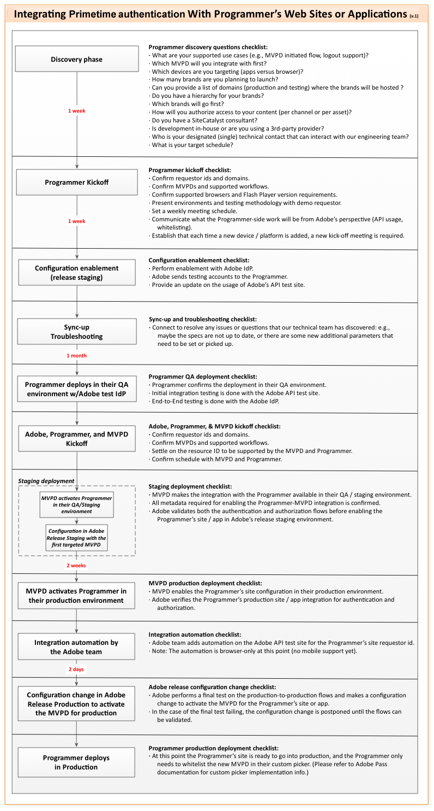

# 程序员kickstart指南 {#programmer-kickstart-guide}

>[!IMPORTANT]
>
> 此页面上的内容仅供参考。 使用此API需要来自Adobe的当前许可证。 不允许未经授权使用。

本快速入门指南面向计划将Adobe®传递身份验证集成到其网站或应用程序中的内容提供商（程序员）。

本文档概述了确保顺利高效地启动集成流程的关键初始步骤。 它旨在明确我们的期望，并为我们如何与合作伙伴协作以实现成功集成提供指导。

Adobe提供了一系列资源，帮助您将Adobe Pass身份验证集成到网站或应用程序中。 请参阅&#x200B;**“您将提供”**&#x200B;和&#x200B;**“Adobe将提供”**&#x200B;提及内容（分别来自以下各节）。

## 设置过程 {#setup-process}

设置过程涉及以下步骤：

*Adobe®通过身份验证集成进程*

**您将在启动阶段提供**：

* **服务提供商（请求者标识符）**

  这是一个字符串，它将唯一标识向Adobe Pass身份验证发出请求的网站或应用程序的品牌。 字符串本身是任意的，但需要在Adobe和程序员之间达成一致

* **渠道信息**

  这是一组字符串，用于标识服务提供商请求的内容渠道。 在许多情况下，渠道和服务提供商是相同的。 但是，单个标识符可以表示多个内容渠道。 这些频道名称字符串应与相应的有线电视频道一致。 请注意，某些MVPD可能会在身份验证和/或授权过程中验证此值。

* **域名**

  此列表将包含实际域名，这些域名将Adobe为表示服务提供商。 它可确保只有授权域才能使用您的元数据访问Adobe Pass身份验证。 请确保为生产和暂存（测试）环境提供并清楚地标识域名，因为这些域名可能不同。

**您将通过MVPD提供**：

* **凭据集**

  这些凭据用于通过MVPD验证和授权用户，或仅验证用户。 通常，这些凭据由用户名和密码组成，MVPD将为这两个配置文件（暂存和生产）向您提供这些用户名和密码。

* **资源标识符**

  这些是服务提供商要保护的内容渠道、节目、集数或资产的唯一标识符。 这些标识符用于请求授权决策，必须与MVPD协商一致。

>[!IMPORTANT]
>
> 程序员负责与MVPD协调，以敲定任何必要的业务协议。 同时，Adobe Pass身份验证将与MVPD协作，确保正确建立技术集成：
>
> * **新MVPD**
>
>     如果MVPD未与Adobe集成，则必须根据MVPD的特定要求开发自定义代码。 在此开发完成之前，MVPD将不可用，并且无法继续使用该MVPD进行产品测试。
>
> * **现有MVPD**
>
>     如果MVPD已与Adobe集成，则连接过程将得到显着简化。 在大多数情况下，可通过配置调整而非广泛开发来快速建立连接。
>
> 所有集成都需要共同的质量保证(QA)工作，包括MVPD的测试，因为最终用户最终是MVPD的客户。 协调测试周期通常取决于MVPD的资源可用性，这可能会导致延迟。

## 访问客户支持 {#access-customer-support}

**Adobe将通过[Zendesk](https://tve.zendesk.com/home)提供**&#x200B;访问我们的客户支持系统的权限。 要访问Zendesk，您必须在https://tve.zendesk.com/home上注册并创建一个帐户。 您可以注册的用户数量没有限制。 注册后，您可以查看和共享任何已提交票证的注释。

Adobe Pass身份验证团队可以帮助您解决在集成过程中可能遇到的任何问题或技术问题。 请通过[tve-support@adobe.com](mailto:tve-support@adobe.com)联系我们。

## 文档访问权限 {#access-documentation}

**Adobe将通过[Adobe Experience League](https://experienceleague.adobe.com/en/docs/pass/authentication/home)提供**&#x200B;对公共文档的访问权限。

Adobe Pass身份验证团队提供了[程序员集成指南](/help/authentication/integration-guide-programmers/programmer-integration-guide-overview.md)部分下可用功能和API的综合文档。 有关每个主题的详细信息的链接，请参阅本节下的目录。

## 访问测试工具 {#access-testing-tool}

**Adobe将通过[Adobe Developer](https://developer.adobe.com/adobe-pass/)网站提供**&#x200B;对我们API探索工具的访问权限。

## 访问配置管理工具 {#access-configuration-management-tool}

**Adobe将通过[Adobe Pass TVE Dashboard](https://experience.adobe.com/pass/authentication)提供**&#x200B;访问自助服务工具的权限，以便管理您的配置和数据。

Adobe Pass身份验证团队在[TVE仪表板用户指南](/help/authentication/user-guide-tve-dashboard/tve-dashboard-overview.md)部分下提供了有关TVE仪表板用法的综合文档。 有关每个主题的详细信息的链接，请参阅本节下的目录。
