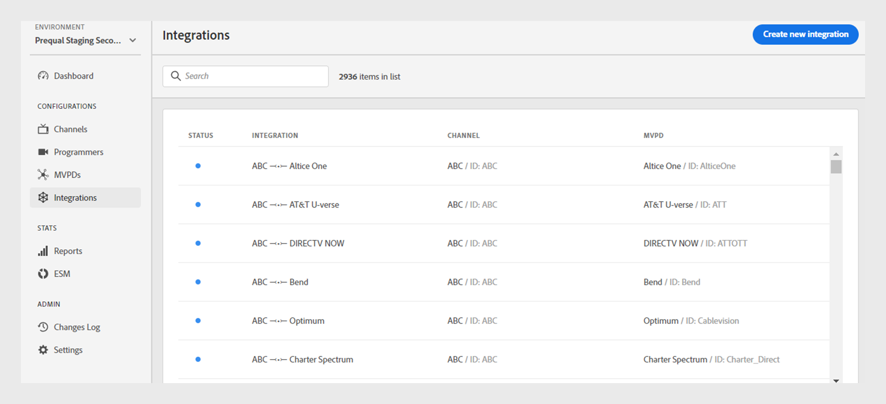

# 集成

>[!NOTE]
>
>此页面上的内容仅供参考。 使用此API需要来自Adobe的当前许可证。 不允许未经授权使用。

此 **集成** 通过TVE仪表板的部分，可查看和管理渠道与MVPD之间集成的设置。 您还可以 [创建新集成](#create-new-integration) 根据您的要求。

此 **集成** 选项卡在左侧面板中显示现有集成的列表，其中包含以下详细信息：

* 指示集成当前是活动还是不活动的状态
* 将特定渠道与相应的MVPD关联的集成
* 具有渠道ID的渠道名称
* MVPD显示名称和MVPD ID

*现有集成的列表*

在中键入通道或MVPD的名称 **Search** 栏了解关于集成的更多信息。

## 管理集成配置 {#manage-integration-conf}

请按照以下步骤管理特定集成。

1. 选择 **集成** 选项卡。
1. 从提供的列表中选择集成，以查看和编辑以下部分中的各种设置：

   * [端点选择](#endpoint-selection)
   * [平台设置](#platform-settings)
   * [用户元数据](#user-metadata)

>[!IMPORTANT]
>
> 视图 [审核和推送更改](/help/authentication/tve-dashboard-review-push-changes.md) 有关激活配置更改的详细信息。

### 端点选择 {#endpoint-selection}

此部分允许您从各自的下拉菜单中选择用于身份验证、授权和注销流的MVPD端点。

*身份验证、授权和注销流的端点*

>[!NOTE]
>
>MVPD可以为每个流提供一个或多个端点。 在集成新通道时，MVPD必须为每个流指定其首选端点。

>[!IMPORTANT]
>
>对端点进行的任何更改都将影响集成的整体行为。 只有在收到MVPD的确认后，才应实施这些更改。

### 平台设置 {#platform-settings}

此部分允许您查看和编辑所有集成设置 [平台](/help/authentication/tve-dashboard-reports.md#platforms). 您可以根据各个平台更改这些设置。 例如，您可以调整Android上的授权TTL持续时间，同时为其他平台保留默认值。

平台设置中的每个属性都继承了MVPD设置的默认值，但如有必要，可以调整该值。

>[!IMPORTANT]
>
>要确定为平台设置中的每个属性设置的值，需要与MVPD达成协议。

>[!IMPORTANT]
>
> 设置继承遵循从MVPD设置（最常用）、MVPD端点、集成、平台类别和platform（包含最具体的值）开始的链。

**平台设置** 用于覆盖继承链中每个级别的设置。 链中的可用级别分组如下：

* **默认为所有**：如果未定义特定的平台值，则为适用于所有平台的属性设置值，而不考虑程序员的实施。

* **桌面设备**：设置适用于所有台式机和笔记本电脑的属性值，不考虑编程方法（JS SDK或REST API）。

* **移动设备**：设置适用于所有移动设备的属性值，包括 **iOS**， **Android**、和其他程序，而不考虑编程方法（SDK或REST API）。

* **TV连接的设备**：设置适用于所有电视连接设备的属性值，包括 **tvOS**， **Roku**， **FireTV**、和其他程序，不考虑编程方法（SDK或REST API）。

* **未识别的设备**：设置适用于当前机制无法准确识别平台的所有设备的属性值。 在这种情况下，应用MVPD定义的最严格的规则。

  

  *平台及其设备的类别*

选择  图标来浏览用于上述每个继承级别的属性。

#### 最常用的业务流程 {#most-used-flows}

此 **平台设置** 部分提供在不同业务流程中使用的一系列属性。 实际属性可能因特定集成中选择的MVPD而异。 以下是最常用的流：

**跨所有平台的AuthN TTL和AuthZ TTL**

>[!IMPORTANT]
>
>身份验证(AuthN) TTL和授权(AuthZ) TTL值必须与MVPD设置一致。

按照以下步骤更改特定集成在所有平台上的身份验证和授权TTL。

1. 选择 **集成** 选项卡。
1. 选择要为其更改身份验证N TTL和身份验证Z TTL值的集成。
1. 导航至 **平台设置** 部分。

1. 选择 **默认为所有** 选项卡在 **平台设置**.

   >[!NOTE]
   >
   >如果要更改以下项的持续时间： **身份验证TTL** 和 **AuthZ TTL** 对于平台类别或特定平台，请相应地选择平台。

   

   *更改所有平台上的AuthN TTL AuthZ TTL持续时间*

   **答：** AuthN TTL属性 **B.** AuthZ TTL属性

1. 选择向上和向下箭头可调整天数、小时数、分钟数和秒数在 **身份验证TTL** 和 **AuthZ TTL** 属性。

的持续时间 **身份验证TTL** 和 **AuthZ TTL** 只有在 [审阅和推送更改](/help/authentication/tve-dashboard-review-push-changes.md).

**启用平台SSO**

>[!IMPORTANT]
>
>**启用单点登录** 属性仅受支持 *iOS、tvOS、Roku和FireTV* 平台。 它仅适用于与支持这些平台单点登录的MVPD的集成。

按照以下步骤为特定集成和平台启用或禁用SSO。

1. 选择 **集成** 选项卡。
1. 选择要为其启用或禁用单点登录的集成。

1. 导航至 **平台设置** 部分。

1. 选择要在其下启用单点登录的特定平台或平台类别 **平台设置**.

   

   *为特定平台启用单点登录*

   **答：** 单点登录属性 **B.** “强制平台权限”属性

1. 选择 **是** 启用或 **否** 从禁用 **启用单点登录** 下拉菜单。

1. 选择 **是** 启用或 **否** 从禁用 **强制平台权限** 下拉菜单。

   **强制平台权限** 属性控制用户是否 **允许** 或 **拒绝** 平台对其电视提供商订阅的访问权限受到尊重。

   例如，如果两者 **启用单点登录** 和 **强制平台权限** 并且用户选择拒绝平台访问其电视提供商订阅，则相应应用程序（频道）将无法使用由其他应用程序（频道）获得的Adobe Pass身份验证令牌。

此 **单点登录** 仅在以下时间后启用或禁用选定平台的属性 [审阅和推送更改](/help/authentication/tve-dashboard-review-push-changes.md).

**启用基于家庭的身份验证**

按照以下步骤为基于OAuth2的MVPD启用或禁用基于主目录的身份验证。

1. 选择 **集成** 选项卡。
1. 选择要为其启用或禁用基于主目录的身份验证的集成。
1. 导航至 **平台设置** 部分。
1. 选择要在其下启用基于主目录的身份验证的特定平台或平台类别 **平台设置**.

   

   *为特定平台启用基于家庭的身份验证*

   **答：** 尝试HBA属性 **B.** HBA AuthN TTL属性

1. 选择 **是** 启用和 **否** 从禁用 **尝试HBA** 下拉菜单。

>[!IMPORTANT]
>
>更改持续时间 **HBA身份验证N TTL** 应避免使用属性。 它可能会导致授权过程中出现意外故障。

此 **尝试HBA** 特定MVPD的属性仅在 [审阅和推送更改](/help/authentication/tve-dashboard-review-push-changes.md).

#### 添加更多属性 {#add-more-properties}

此 **添加更多属性** 允许灵活地为集成包含其他特定属性，尤其是对于不太常见的流。

您可以添加以下属性：

* 对于所有平台，选择 **默认为所有** 选项卡。
* 对于平台的类别，选择 **桌面设备**， **移动设备**，或 **TV连接的设备** 选项卡。
* 对于特定设备，选择 **iOS**， **Android**， **tvOS**， **Roku**，或 **FireTV** 选项卡。

以下是可以通过添加这些属性启用的不同流的一些示例：

**更改预授权资源的数量**

默认情况下，大多数MVPD支持最多使用5个资源ID的预检authZ调用。
但是，如果MVPD同意提高此限制，则可以导航到 **添加更多属性** 并选择 **预检最大资源** （从选项菜单中）。

**预检最大资源** 将添加新属性，以便指定与MVPD商定的限制。

*添加预检最大资源属性*

此 **预检最大资源** 属性将仅在 [审阅和推送更改](/help/authentication/tve-dashboard-review-push-changes.md).

**更改MVPD显示名称或徽标URL**

对于不想构建其MVPD选取器而是依赖提供的配置的程序员应用程序，您可以导航到 **添加更多属性** 并选择 **显示名称** 或 **徽标URL** 从“选项”菜单为每个MVPD添加所需的显示名称或徽标URL。

这些属性的不同值可用于相同的MVPD，具体取决于设备平台和所需的用户体验。

*添加显示名称或徽标URL属性*

此 **显示名称** 或 **徽标URL** 属性将仅在 [审阅和推送更改](/help/authentication/tve-dashboard-review-push-changes.md).

**在应用程序（渠道）切换时请求新的身份验证流程**

如果要在用户在不同应用程序之间切换时强制进行新身份验证。 在这种情况下，您可以导航至 **添加更多属性**，选择 **每个聚合器的身份验证** 属性。

正在添加 **每个聚合器的身份验证** 有效地中断了相应渠道的单点登录。

*为每个聚合器属性添加身份验证*

此 **每个聚合器的身份验证** 属性将仅在 [审阅和推送更改](/help/authentication/tve-dashboard-review-push-changes.md).

添加后，选择 **是** 以启用 **每个聚合器的身份验证** 选定集成的属性。

#### 删除属性 {#delete-properties}

选择  图标来删除不再需要的属性。

>[!NOTE]
>
>无法删除某些属性，因为它们是所选MVPD的必需要求。

该属性将从以下删除： **平台设置** 部分仅晚于 [审阅和推送更改](/help/authentication/tve-dashboard-review-push-changes.md).

### 用户元数据 {#user-metadata}

此部分允许您更新MVPD共享的每个用户元数据参数的设置。

>[!NOTE]
>
>每个MVPD可以共享不同的参数。 有关特定MVPD可以共享的参数的更多信息，请联系您的Adobe代表。

用户元数据部分显示以下列：

**键**：表示要在API中用于提取值的实际用户元数据参数。

**描述**：简要描述每个用户元数据参数。

**已加密**：此列允许您通过选择启用或禁用API中的参数 **是** 或 **否** （分别从下拉菜单中）。 选择加入 **是** 指示将在API中对参数值进行加密。 使用由定义的证书执行加密 **用户元数据** 范围。

>[!TIP]
>
>
> 始终确保 **ZIP** 参数已加密。

要了解有关可用证书的更多信息，请参阅 [程序员](/help/authentication/tve-dashboard-programmers.md#available-certificates) 和 [渠道](/help/authentication/tve-dashboard-channels.md#available-certificates) 部分。

**已启用**：此列允许您通过选择启用或禁用API中的参数 **是** 或 **否** 分别从下拉菜单中访问。

*可用于用户元数据的参数*

## 创建新集成 {#create-new-integration}

要在当前设置中创建与新MVPD的新集成，请执行以下步骤：

1. 选择 **集成** 选项卡。
1. 选择 **创建新集成** 右上角的 **集成** 部分。

   

   *创建新集成*

   将显示以下部分：

   **选择通道和MVPD**

   选择 **渠道** 从 **选择渠道** 用于添加新集成的下拉菜单。 选择渠道后，选择所需的 **MVPD** 从 **选择MVPD** 要与所选渠道集成的下拉菜单。

   

   *选择通道和MVPD*

   **选择端点**

   选择所需的MVPD后， **选择端点**  部分中将预填充为该特定MVPD配置的默认端点。

   >[!IMPORTANT]
   >
   >不更改任何流中的默认端点，除非MVPD特别说明。

   

   *选择端点*

   **其他信息**

   本节包括需要在以下位置为所选MVPD配置的各种属性： **选择通道和MVPD** 部分。

   >[!NOTE]
   >
   > 实际属性可能会有所不同，具体取决于在中选择的MVPD **选择通道和MVPD** 部分。

   例如，您可以编辑 **身份验证TTL** 或 **合作伙伴ID** （渠道ID），用于下图中的MVPD登录页面上的品牌联合。

   

   *编辑其他信息*

   选择 **保存集成** 右上角的 **创建新集成** 部分。

仅在以下时间后创建新的集成 [审阅和推送更改](/help/authentication/tve-dashboard-review-push-changes.md).

## 禁用集成 {#disable-integratgion}

要禁用集成，请执行以下步骤：

1. 选择 **集成** 选项卡。
1. 选择要禁用的集成。
1. 禁用所选集成右上角的切换。

   

   *禁用集成*

集成仅在以下情况下被禁用： [审阅和推送更改](/help/authentication/tve-dashboard-review-push-changes.md).

禁用集成后，最终用户将无法使用特定的MVPD进行身份验证或授权。

