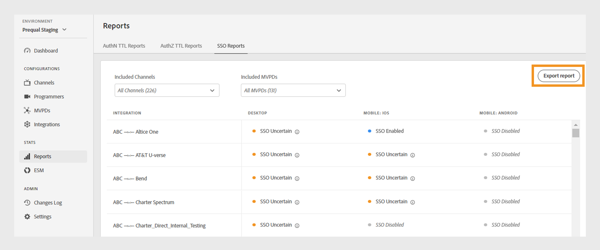

# 报告 {#Reports}

>[!NOTE]
>
>此页面上的内容仅供参考。 使用此API需要来自Adobe的当前许可证。 不允许未经授权使用。

此 **报表** 通过TVE仪表板部分，可以访问AuthN TTL、AuthZ TTL和SSO报表的聚合数据。 这些报表包括您的渠道集成与所有报表中的不同MVPD [平台](#platforms).

通过报表，您可以过滤数据并收集跨以下领域的洞察 [特定渠道或MVPD](#selecting-specific-channels-mvpds). 您还可以将报表导出为CSV文件以供进一步分析。

## 查看报表 {#view-reports}

按照以下步骤查看特定报告。

1. 选择 **报表** 选项卡。
1. 选择以下选项卡之一以查看和导出包含的通道和MVPD的聚合数据：
   * [AuthN TTL报表](#authn-ttl-reports)
   * [AuthZ TTL报表](#authz-ttl-reports)
   * [SSO报告](#sso-reports)

   

   *报告类型*

### AuthN TTL报表 {#authn-ttl-reports}

AuthN TTL报告(也称为身份验证生存时间(TTL))显示为渠道与所有渠道中的各种MVPD集成配置身份验证令牌的持续时间 [平台](#platforms). 这些报告允许您检查用户在特定MVPD和平台中保持身份验证的时间。 持续时间值以用户友好的格式显示，例如， **天**， **小时**， **分钟**、和 **秒**. AuthN TTL报告表具有水平滚动和垂直滚动功能，以适应不同的屏幕大小。

您还可以查看和下载以下项的数据 [特定渠道或MVPD](#selecting-specific-channels-mvpds).

*导出AuthN TTL报告*

>[!IMPORTANT]
>
> 此 **由MVPD设置** 当MVPD强制使用AuthN TTL值(而不是Adobe Pass身份验证配置)时，将使用占位符。

选择 **导出报告** 以将数据另存为CSV文件。

### AuthZ TTL报表 {#authz-ttl-reports}

AuthZ TTL报告(也称为授权生存时间(TTL))显示为您的渠道与所有渠道的各种MVPD集成配置的授权令牌的持续时间 [平台](#platforms). 利用这些报告，可检查用户保持有权观看特定MVPD和平台内容的时间。 持续时间值以用户友好的格式显示，例如， **天**， **小时**， **分钟**、和 **秒**. AuthZ TTL报告表具有水平滚动和垂直滚动功能，以适应不同的屏幕大小。

您还可以查看和下载以下项的数据 [特定渠道或MVPD](#selecting-specific-channels-mvpds).

*导出AuthZ TTL报表*

>[!IMPORTANT]
>
> 此 **由MVPD设置** 当MVPD强制使用AuthZ TTL值(而不是Adobe Pass身份验证配置)时，将使用占位符。

选择 **导出报告** 以将数据另存为CSV文件。

### SSO报告 {#sso-reports}

SSO报告（也称为单点登录）显示为您的渠道与所有渠道的各种MVPD集成配置的单点登录状态。 [平台](#platforms). 这些报告允许您检查特定MVPD和平台的预期用户身份验证SSO体验。 这些值以用户友好的格式显示，例如 **SSO已禁用**， **已启用SSO**、和 **SSO不确定**. SSO报告表具有水平滚动和垂直滚动功能，以适应不同的屏幕大小。

您还可以查看和下载以下项的数据 [特定渠道或MVPD](#selecting-specific-channels-mvpds).

*导出SSO报告*

>[!IMPORTANT]
>
> 此 **SSO不确定** 占位符表示单点登录(SSO)已启用，并且可能正在运行。 但是，下面列出的设置可能会禁止SSO身份验证，如以下示例中所述：
>
> * 用户平台设置：阻止第三方Cookie的选项。
> * 用户决策：用户拒绝平台访问其电视提供商订阅。
> * MVPD设置： MVPD请求每个通道的身份验证。

选择 **导出报告** 以将数据另存为CSV文件。

## 平台 {#platforms}

此 [AuthN TTL报表](#authn-ttl-reports)， [AuthZ TTL报表](#authz-ttl-reports)、和 [SSO报告](#sso-reports) 跨各种平台呈现数据，例如：

* **桌面**：显示通过Adobe Pass身份验证JavaScript SDK应用于程序员实施的值。

* **移动设备**

  **iOS**：显示使用Adobe Pass身份验证iOS SDK应用的值。

  **Android**：显示通过Adobe Pass身份验证Android SDK应用的值。

  **其他**：显示使用为移动设备开发的Adobe Pass身份验证REST API应用的值。

* **TVCD**

  **Roku**：显示通过Adobe Pass身份验证REST API应用的值，将Roku标识为设备类型。

  **FireTV**：显示通过Adobe Pass身份验证FireTV SDK应用的值。

  **AppleTV**：显示通过Adobe Pass身份验证tvOS SDK应用的值。

  **其他**：显示使用Adobe Pass身份验证REST API为电视连接设备应用的值。

* **平台未识别**：当Adobe Pass身份验证服务检测到未知设备类型时，显示应用于程序员实施的值。

要了解有关如何共享所需设备类型的更多信息，例如 **Roku** 使用Adobe Pass身份验证REST API或SDK，查看机制 [传递客户端信息](/help/authentication/passing-client-information-device-connection-and-application.md).

>[!IMPORTANT]
>
> 聚合的数据基于每个Adobe Pass身份验证环境的特定配置。 在不同的TVE功能板环境之间切换时，需要报表中的数据变化。 请参阅 [Adobe Pass身份验证环境](/help/authentication/tve-dashboard-environments.md) 了解更多信息。

## 选择特定渠道和MVPD {#selecting-specific-channels-mvpds}

此 [AuthN TTL报表](#authn-ttl-reports)， [AuthZ TTL报表](#authz-ttl-reports)、和 [SSO报告](#sso-reports) 显示以下项的数据 **所有渠道** 与集成 **所有MVPD** 默认情况下。

>[!NOTE]
>
> 如果取消选择 **所有渠道** 或 **所有MVPD** 在相应的下拉菜单中，将显示一条消息，以便进行选择以查看有意义的报告。

要生成特定渠道的报告，请执行以下操作：

1. 选择 **包含的渠道** 选定报告顶部的下拉菜单。

   

   *包含的渠道下拉菜单*

1. 取消选择 **所有渠道**.
1. 从中选择所需的渠道 **包含的渠道** 要为其生成数据的下拉菜单。

>[!NOTE]
>
> 要在 **包含的MVPD** 下拉菜单中，您必须至少选择一个渠道 **包含的渠道** 下拉菜单。

要为特定MVPD生成报告，请执行以下操作：

1. 选择 **包含的MVPD** 选定报告顶部的下拉菜单。

   

   *包含的MVPD下拉菜单*

1. 取消选择 **所有MVPD**.
1. 从中选择所需的MVPD **包含的MVPD** 要为其生成数据的下拉菜单。
