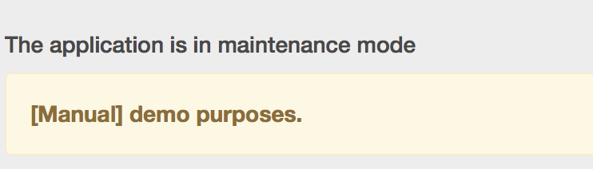

# Primetime TVE仪表板用户指南 {#tve-db-user-guide}

>[!NOTE]
>
>此页面上的内容仅供参考。 使用此API需要来自Adobe的当前许可证。 不允许未经授权使用。

## 简介 {#tve-db-intro}

[[!DNL Adobe] TVE仪表板（TVE仪表板）](https://console.auth.adobe.com/)是一个自助仪表板，面向为与Adobe Pass身份验证产品团队有业务关系的媒体公司（程序员）工作的用户。

请联系您的技术客户经理(TAM)以获取访问权限。 要获得访问权限，您需要在Adobe Marketing Cloud组织中配置两个新用户组：

* TVE仪表板读写 — 此组的成员对仪表板的所有可编辑部分具有完全权限
* TVE仪表板只读 — 此组的成员在整个仪表板中仅具有查看权限

在深入研究本用户指南之前，我们建议您浏览以下资源，以便很好地了解Adobe Pass身份验证产品团队提供的流程和功能，并熟悉本文档中使用的术语：

* [TVE技术文档](/help/authentication/technical-paper.md)
* [程序员Kickstart指南](/help/authentication/programmer-kickstart-guide.md)
* [权利流](/help/authentication/entitlement-flow.md)
* [术语表](/help/authentication/glossary.md)

继续本用户指南的后续部分，您将发现如何为公司的渠道、程序员或渠道与MVPD（多渠道视频项目分发商）之间的集成管理不同的设置。

>[!IMPORTANT]
>TVE功能板提供了在Basic和Advanced Workspace之间切换的选项。 您可以通过切换右上角的图标来完成此操作。 高级Workspace面向具有大量技术知识以及对Adobe Pass身份验证产品团队提供的功能具有高级知识的用户。

*图1： Adobe Primetime TVE功能板“基本/高级Workspace”下拉列表*

## 环境 {#authn-environments}

根据用户可能需要执行的任务，可能需要在Adobe Pass身份验证环境之间切换。 有关Adobe Pass身份验证环境的详细信息，请参阅以下文档： [了解Adobe Pass身份验证环境](/help/authentication/understanding-the-adobe-environments.md)。

TVE Dashboard提供两个名为Prequal (Prequalification)和Release的环境，每个环境都有两个名为Staging和Production的用户档案，如下所示：

* [前置暂存](https://console-prequal.auth-staging.adobe.com/)
* [前期生产](https://console-prequal.auth.adobe.com/)
* [发布暂存](https://console.auth-staging.adobe.com/)
* [发布生产](https://console.auth.adobe.com/)

要在环境之间切换，用户可以单击下面描述的下拉元素中由条目表示的所需环境：

*图2： Adobe Pass TVE仪表板环境下拉列表*

>[!IMPORTANT]
>
>请务必注意，在通过TVE仪表板对Adobe Pass身份验证配置进行管理更改时，我们强烈建议您遵循以下顺序以确保正常运行。

要通过TVE仪表板对Adobe Pass身份验证配置进行管理更改，请执行以下操作：

* 在[发布暂存中执行更改并验证它们](http://sp.auth-staging.adobe.com/apitest/api.html)。
* 在[前期生产中执行更改并验证它们](http://sp.auth-staging.adobe.com/apitest/api.html)。
* 在[发布生产环境中执行更改并验证它们](http://sp.auth-staging.adobe.com/apitest/api.html)。

>[!IMPORTANT]
>
>要使管理更改生效，用户必须通过选择按钮（将显示在侧栏的左下方）导航到“审阅和推送更改”部分，以便审阅更改、为新创建的更改添加描述并通过选择“推送配置”确认配置更新。

*图3： Adobe Primetime TVE仪表板审核和推送更改通知*

## 区域 {#sections}

为媒体公司工作的用户（程序员）可以从侧栏访问TVE仪表板的以下部分：

* **渠道** — 包含与内容提供商相关的设置
* **程序员** — 包含与聚合一个或多个&#x200B;**渠道**&#x200B;的父组织相关的设置
* **集成** — 包含与&#x200B;**渠道**&#x200B;和&#x200B;**MVPD**&#x200B;之间的集成相关的设置
* **MVPD** — 包含与可用的&#x200B;**MVPD**&#x200B;相关的设置
* **报表** — 包含三种类型报表的聚合数据：AuthN TTL、AuthZ TTL、SSO
* **更改日志** — 包含应用于TVE仪表板配置的最新修改

*图4： Adobe Primetime TVE仪表板节*

### 渠道 {#tve-db-channels-section}

此部分允许查看和编辑可用渠道的设置或创建新渠道。 单击其中一个可用渠道将返回一个包含以下选项卡的屏幕：

* **渠道数据**
   * **渠道ID** — 我们系统中使用的渠道唯一ID，也称为“请求者ID”。
   * **显示名称** — 渠道的商业名称。
* **常规设置**
   * **Analytics配置** — 配置Adobe Pass身份验证事件以转发到Adobe Analytics。 有关在启用此功能之前需要如何配置报表包ID (RSID)的更多详细信息，请与Adobe联系。
* **证书**

  包含身份验证流程中使用的证书列表及其颁发组织、颁发日期和到期日期。 这些证书用作私钥/公钥，并用于验证目的。
* **域**

  包含域列表，相应的渠道将通过这些域与Adobe Pass身份验证进行通信。
* **集成**

  包含与可用MVPD的集成的列表，以及每个可能启用的或未启用的集成的状态。 单击特定条目即可导航到集成页面。
* **已注册的应用程序**

  包含应用程序注册列表。 有关更多详细信息，请查看文档[动态客户端注册管理](/help/authentication/dcr-api/dynamic-client-registration-overview.md#dynamic-client-registration-management)。

* **自定义架构**

  包含自定义方案的列表。 有关更多详细信息，请参阅[iOS/tvOS应用程序注册](/help/authentication/iostvos-application-registration.md)和[动态客户端注册管理](/help/authentication/dcr-api/dynamic-client-registration-overview.md#dynamic-client-registration-management)

#### 添加/删除域 {#add-delete-domains}

要启动为所选渠道添加新域的过程，您需要单击“域”列表下方的“添加新域”按钮。 这将创建一个新的域条目，您可以在其中指定域名。 如果域列表中已存在更通用的域，则不应添加新子域。

*图：渠道中的“域”选项卡*

#### 在渠道级别创建注册的应用程序 {#create-registered-application-channel-level}

要在渠道级别创建注册的应用程序，请导航到“渠道”菜单，然后选择要为其创建应用程序的渠道。 然后，在导航到“注册的应用程序”选项卡后，单击“添加新应用程序”按钮。

如下图所示，您应填写的字段包括：

* **应用程序名称** — 应用程序的名称

* **分配给渠道** — 如下所示，与程序员级别执行的相同操作相比，此处稍有不同的是“已分配渠道”下拉列表，该下拉列表未启用，因此没有选项将注册的应用程序绑定到当前渠道以外的其他渠道。

* **应用程序版本** — 默认情况下，该版本设置为“1.0.0”，但我们强烈建议您使用自己的应用程序版本对其进行修改。 作为最佳实践，如果您决定更改应用程序的版本，请通过为其创建新的已注册应用程序来反映该版本。

* **应用程序平台** — 要链接的应用程序平台。 您可以选择选择所有值或多个值。

* **域名** — 要链接的应用程序所属的域。 下拉列表中的域是从所有渠道中统一选择的所有域。 您可以选择从列表中选择多个域。 域的含义是重定向URL [RFC6749](https://tools.ietf.org/html/rfc6749)。 在客户端注册过程中，客户端应用程序可请求允许使用重定向URL来最终确定身份验证流。 当客户端应用程序请求特定的重定向URL时，将针对与软件语句关联的此注册应用程序中列出的白名单域验证该URL。

在用适当的值填写字段后，您必须单击“完成”才能将应用程序保存在配置中。

请注意，**没有用于修改已创建的应用程序的选项**。 如果发现创建的某个内容不再满足要求，则需要创建一个新的已注册应用程序，并将其与满足其要求的客户端应用程序一起使用。

##### 下载软件声明 {#download-software-statement-channel-level}

单击需要软件语句的列表项上的“下载”按钮将生成文本文件。 此文件将包含类似于以下示例输出的内容。

文件的名称通过以“software_statement”为前缀并添加当前时间戳进行唯一标识。

请注意，对于同一已注册应用程序，每次单击下载按钮时都会收到不同的软件语句，但这不会使先前为此应用程序获得的软件语句失效。 之所以发生这种情况，是因为它们是根据操作请求即时生成的。

下载操作存在一个&#x200B;**限制**。 如果在创建注册的应用程序后不久通过单击“下载”按钮请求软件语句，但尚未保存该语句并且配置json未同步，则页面底部将显示以下错误消息。

这会包装从核心收到的HTTP 404 Not Found错误代码，因为已注册应用程序的ID尚未传播，并且核心不知道它。

解决方案是在创建注册的应用程序后，最多等待2分钟以使配置同步。 发生这种情况后，将不再收到错误消息，并且包含软件语句的文本文件将可供下载。

### 程序员 {#tve-db-programmers-section}

此部分允许查看和编辑可用程序员的设置或创建新设置。 单击其中一个可用的程序员将返回一个包含以下选项卡的屏幕：

* **程序员数据**
   * **程序员ID** — 系统中使用的程序员的唯一ID。
   * **显示名称** — 程序员的商业名称。
   * **徽标Url** — 程序员的商业徽标统一资源定位器(URL)。
   * **徽标预览** — 通过从上述统一资源定位器(URL)下载程序员的商业徽标预览。

* **证书**

  包含身份验证流程中使用的证书列表及其颁发组织、颁发日期和到期日期。 这些证书用作私钥/公钥，并用于验证目的。

* **渠道**

  包含属于此特定程序员的渠道列表。 单击特定条目，即可使用导航到渠道部分。

* **已注册的应用程序**

  包含应用程序注册列表。 有关详细信息，请参阅[动态客户端注册管理](/help/authentication/dcr-api/dynamic-client-registration-overview.md#dynamic-client-registration-management)。

* **自定义架构**

  包含自定义方案的列表。 有关详细信息，请参阅[iOS/tvOS应用程序注册](/help/authentication/iostvos-application-registration.md)。

#### 在程序员级别创建注册的应用程序 {#create-registered-application-programmer-level}

转到&#x200B;**程序员** > **已注册的应用程序**&#x200B;选项卡。

在“已注册的应用程序”选项卡中，单击&#x200B;**添加新应用程序**。 在新窗口中填写必填字段。

如下图所示，您应填写的字段包括：

* **应用程序名称** — 应用程序的名称

* **分配给渠道** — 您的渠道的名称，此应用程序链接的to。 下拉掩码中的默认设置为&#x200B;**所有通道。**&#x200B;该界面允许您选择一个通道或选择所有通道。

* **应用程序版本** — 默认情况下，该版本设置为“1.0.0”，但我们强烈建议您使用自己的应用程序版本对其进行修改。 作为最佳实践，如果您决定更改应用程序的版本，请通过为其创建新的已注册应用程序来反映该版本。

* **应用程序平台** — 要链接的应用程序平台。 您可以选择选择所有值或多个值。

* **域名** — 要链接的应用程序所属的域。 下拉列表中的域是从所有渠道中统一选择的所有域。 您可以选择从列表中选择多个域。 域的含义是重定向URL [RFC6749](https://tools.ietf.org/html/rfc6749)。 在客户端注册过程中，客户端应用程序可请求允许使用重定向URL来最终确定身份验证流。 当客户端应用程序请求特定的重定向URL时，将针对与软件语句关联的此注册应用程序中列出的白名单域验证该URL。

在用适当的值填写字段后，您必须单击“完成”才能将应用程序保存在配置中。

请注意，**没有用于修改已创建的应用程序的选项**。 如果发现创建的某个内容不再满足要求，则需要创建一个新的已注册应用程序，并将其与满足其要求的客户端应用程序一起使用。

##### 下载软件声明 {#download-software-statement-programmer-level}

单击需要软件语句的列表项上的“下载”按钮将生成文本文件。 此文件将包含类似于以下示例输出的内容。

文件的名称通过以“software_statement”为前缀并添加当前时间戳进行唯一标识。

请注意，对于同一已注册应用程序，每次单击下载按钮时都会收到不同的软件语句，但这不会使先前为此应用程序获得的软件语句失效。 之所以发生这种情况，是因为它们是根据操作请求即时生成的。

下载操作存在一个&#x200B;**限制**。 如果在创建注册的应用程序后不久通过单击“下载”按钮请求软件语句，但尚未保存该语句并且配置json未同步，则页面底部将显示以下错误消息。

这会包装从核心收到的HTTP 404 Not Found错误代码，因为已注册应用程序的ID尚未传播，并且核心不知道它。

解决方案是在创建注册的应用程序后，最多等待2分钟以使配置同步。 发生这种情况后，将不再收到错误消息，并且包含软件语句的文本文件将可供下载。

### 集成 {#tve-db-integrations-sec}

此部分允许查看和编辑渠道与可用MVPD之间集成的设置，或创建新渠道。 使用基本Workspace时，单击其中一个可用集成将返回单个页面，或者在使用高级Workspace时，会返回一个包含以下选项卡的屏幕：

* **集成数据**
   * **集成ID** — 将MVPD的唯一ID附加到以“_”字符分隔的渠道的唯一ID的结果。
   * **渠道显示名称** — 渠道的商业名称。
   * **渠道ID** — 我们系统中使用的渠道唯一ID，也称为“请求者ID”。
   * **MVPD显示名称** - MVPD的商业名称。
   * **MVPD ID** — 系统中使用的MVPD的唯一ID。
* **常规设置**
   * **用户元数据键** — 配置可用于特定集成的元数据键。
   * **平台特定的设置** — 为特定平台配置不同的设置（例如，TTL、SSO和IFrames）。

* **身份验证设置**
   * 包含与Adobe Pass身份验证功能相关的设置。
* **授权设置**
   * 包含与Adobe Pass身份验证授权功能相关的设置。
* **注销设置**
   * 包含与Adobe Pass身份验证注销功能相关的设置。

#### 创建集成 {#create-integration}

要创建新集成，请执行以下步骤：

* 单击“添加新集成”按钮
* 搜索并选择渠道
* 搜索并选择MVPD
* 等待TVE功能板计算“集成ID”并显示可用的MVPD端点
* 选择身份验证、授权和注销端点或使用默认值
* 单击“创建集成”按钮
* 根据MVPD设置，可能会出现弹出窗口并询问其他属性，这些属性应由MVPD预先提供，否则将重定向到新创建的集成页面

*图5. Adobe Primetime TVE仪表板新集成窗口*

#### 更新集成 {#update-integration}

要更新现有集成，请在集成部分或渠道部分（包含集成选项卡）中单击该特定集成的表条目。

使用基本Workspace模式时，此部分将允许查看和编辑最常更新的设置，例如身份验证和授权令牌TTL（生存时间）以及iFrame设置。 请记住，与支持动态定义的令牌持久性TTL的MVPD的集成可能缺少TTL设置（请参阅[MVPD集成要求](/help/authentication/mvpd-integr-features.md)中的条目1.19）。

使用高级Workspace模式时，此部分将允许查看和编辑不太常见的设置。

在基本和高级Workspace模式中，可以在平台级别更改这些设置(例如，为Android上的授权TTL令牌选择一个自定义值，默认设置是在所有其他平台上)。

>[!IMPORTANT]
>了解设置继承链很重要： MVPD -> MVPD端点 — >集成 — > Platform ，其中Platform具有最具体的值，而MVPD是最通用的默认值。

*图6。 Adobe Primetime TVE仪表板属性继承链组件*

#### 平台特定的设置 {#platform-sp-settings}

此子部分可用于覆盖特定平台的设置。 可用的平台包括：

* **所有平台** — 设置将应用于所有平台的值，不考虑程序员实施，以防没有为特定平台设置其他值。
* **Android** — 设置将通过Adobe Pass身份验证Android SDK应用于程序员实施的值。
* **无客户端REST API** — 设置将通过Adobe Pass身份验证REST API应用于程序员实施的值。
* **Fire TV** — 设置将通过Adobe Pass Authentication FireTV SDK应用于程序员实施的值。
* **Flash的SDK** — 此平台已弃用。 **已弃用**
* **JavaScript SDK** — 设置将通过Adobe Pass身份验证JavaScript SDK应用于程序员实施的值。
* **Roku** — 设置将通过Adobe Pass身份验证REST API应用于程序员实施的值，并将发送“Roku”作为设备类型。 对于Roku设备，其优先于为无客户端REST API平台设置的值。
* **Xbox本机SDK** — 已弃用此平台。 **已弃用**
* **Xbox 360 REST API** — 设置将通过Adobe Pass身份验证REST API应用于程序员实施的值，并将发送“xbox”作为设备类型。 对于Xbox 360设备，其优先级高于为无客户端REST API平台设置的值。
* **Xbox One REST API** — 设置将通过Adobe Pass身份验证REST API应用于程序员实施的值，并将发送“xboxOne”作为设备类型。 对于XboxOne设备，其优先级高于为无客户端REST Api平台设置的值。
* **iOS** — 设置将通过Adobe Pass身份验证iOS SDK应用于程序员实施的值。
* **tvOS** — 设置将通过Adobe Pass身份验证tvOS SDK应用于程序员实施的值。

*图7。 Adobe Primetime TVE仪表板平台特定的设置*

#### 启用Platform单点登录 {#enable-platform-sso}

请按照以下步骤为特定集成和平台启用/禁用单点登录：

* 确保您使用的是高级Workspace模式
* 导航到所需的集成
* 导航到&#x200B;**常规设置**&#x200B;选项卡
* 选择要启用或禁用单点登录的所需平台
* 将&#x200B;**启用单点登录**&#x200B;标志切换为所需的值（是/否）

  >[!IMPORTANT]
  >需要注意的是，**启用单点登录**&#x200B;标记仅适用于iOS、tvOS、Roku和FireTV平台，并且仅适用于与支持这些平台单点登录的MVPD的集成。

* 将&#x200B;**强制平台权限**&#x200B;标志切换为所需的值（是/否）

  >[!IMPORTANT]
  >需要注意的是，**强制平台权限**&#x200B;标志控制是否强制执行用户允许或拒绝平台访问其电视提供商订阅的决定。 考虑到&#x200B;**启用单点登录**&#x200B;标志设置为“是”的情况，**强制平台权限**&#x200B;标志也设置为“是”，并且用户选择拒绝平台访问其电视提供商订阅，则相应应用程序（频道）将无法使用另一个应用程序（频道）获得的Adobe Pass身份验证令牌。

#### 启用基于家庭的身份验证 {#enable-hba}

请按照以下步骤为基于&#x200B;**OAuth2**&#x200B;的MVPD启用/禁用家庭身份验证：

* 确保您使用的是高级Workspace模式
* 导航到所需的集成
* 导航到&#x200B;**身份验证设置**&#x200B;选项卡
* 导航到&#x200B;**AuthN动态规则**&#x200B;子选项卡
* 将&#x200B;**Attempt HBA**&#x200B;标志切换为所需的值（是/否）

>[!IMPORTANT]
>请记住，绝不应覆盖“HBA AuthN TTL”值，否则授权流可能会意外失败。

有关为基于SAML的MVPD启用Home-Base身份验证的信息，请联系&#x200B;**tve-support@adobe.com**。

### MVPDs {#tve-db-mvpds-sec}

此部分允许查看可用MVPD的设置。 单击其中一个可用的MVPD将返回一个包含以下选项卡的屏幕：

* **MVPD数据**
   * **MVPD ID** — 系统中使用的MVPD的唯一ID。
   * **显示名称** — 用户选取器中可能使用的MVPD的商业名称。
   * **徽标Url** - MVPD的商业徽标统一资源定位器(URL)。
   * **徽标预览** — 通过从上述统一资源定位器(URL)下载MVPD的商业徽标预览。
* **常规设置**
   * **用户元数据键**
      * 可用于特定MVPD的元数据键。
   * **客户端数据属性**
      * **身份验证/聚合器** — 如果设置为“是”，则用户尝试访问的每个新渠道都需要一个新的身份验证令牌。
      * **被动身份验证已启用** — 如果Auth/Aggregator标志设置为“是”，并且Passive AuthN Enabled设置为“是”，则后台将执行使用其他渠道的身份验证过程，而无需显示完整的浏览器重定向和选取器。
      * **身份验证/浏览器会话** — 如果设置为“是”，则用户将在关闭浏览器后注销。 如果设置为“否”，则用户可以重新启动浏览器并保持登录状态。
      * **需要IFrame** — 如果设置为“是”，则表示MVPD登录窗口需要iFrame。 “iFrame宽度”和“iFrame高度”字段表示加载MVPD登录页面的iFrame所需的大小。
* **身份验证设置**
   * **选择终结点**
      * 此字段指示MVPD公开的身份验证终结点。 端点可以因所使用的身份验证协议而异。
   * **AuthN常规设置**
      * 此子选项卡显示MVPD使用的验证协议和协议相关信息。
   * **AuthN证书**
      * 此子选项卡显示MVPD在身份验证流中使用的证书及其颁发者组织、颁发日期和到期日期。 这些证书用作私钥/公钥，并用于验证目的。
   * **AuthN动态规则**
      * 此子选项卡显示应用于身份验证进程的规则。 按下图表的请求/响应/令牌后，您可以看到高亮显示应用于该部分身份验证流程的参数。
* **授权设置**
   * **选择终结点**
      * 此字段指示MVPD公开的授权终结点。 端点可能会因所使用的授权协议而异。 可用的授权协议为SOAP、REST（用于无客户端设备）、SAML、XACML和OAUTH。
   * **AuthZ常规设置**
      * 此子选项卡显示MVPD使用的授权协议和协议相关信息。
      * **预检配置**
         * 它描述在一次调用中可由MVPD预授权的资源数量、使用的PreFlight模型以及超时阈值。 有时，给定集成的资源数量可能不同。 可通过编辑“常规设置”选项卡下的“**最大预检资源数**”属性来管理此操作。 此属性仅适用于给定的集成，如果设置，将使用该属性，而不是授权设置 — > PreFlight配置 — > PreFlight最大资源中定义的值。
      * **DOS保护**
         * 它描述了MVPD授权端点上的拒绝服务保护。 有关每个字段的详细说明，请将鼠标悬停在DOS保护字段上以查看工具提示。
      * 如果MVPD是&#x200B;**TempPass**，则&#x200B;**AuthZ常规设置**&#x200B;也包含有关TempPass持续时间的信息。
      * 如果MVPD是&#x200B;**FlexibleTempPass**，则&#x200B;**AuthZ常规设置**&#x200B;还包含有关TempPass持续时间、最大资源数和标识字段的信息（请参阅以下图像）。
   * **AuthZ证书**
      * 此子选项卡显示MVPD在授权流中使用的证书及其颁发者组织、颁发日期和到期日期。 这些证书用作私钥/公钥，并用于验证目的。
   * **AuthZ动态规则**
      * 此子选项卡显示应用于授权进程的规则。 按下图表的&#x200B;**请求/响应/令牌**&#x200B;后，您可以看到高亮显示应用于该授权流部分的参数。
* **注销设置**
   * **选择终结点**
      * 此字段指示MVPD公开的注销终结点。 提供的协议可以是SAML或OAuth2。
      * **注销常规设置**
         * 此子选项卡显示MVPD使用的注销协议和协议相关信息。
         * **需要已签名的注销响应** — 如果设置为“是”，则响应必须由受信任的证书签名。
      * **注销证书**
         * 此子选项卡显示MVPD在注销流中使用的证书及其颁发者组织、颁发日期和到期日期。 这些证书用作私钥/公钥，并用于验证目的。
      * **注销动态规则**
         * 此子选项卡显示适用于注销流程的规则。 按下图表的&#x200B;**请求/响应/令牌**&#x200B;后，您可以看到应用于该部分注销流的参数已突出显示。

### 报告 {#tve-db-reports-sec}

要导航到此部分，请单击“[仪表板部分](#sections)”菜单中的“报告”。 该操作将导航到包含3个选项卡的屏幕，将在以下子部分中详细介绍：[AuthN TTL报告](#authn-ttl-reports)、[AuthZ TTL报告](#authz-ttl-reports)、[SSO报告](#sso-reports)。

此部分允许您查看和导出多种类型报表的聚合数据，这些报表用于您在所有平台上与各种MVPD的渠道集成。

#### 平台 {#report-platforms}

所有报表汇总以下平台中的值：

**浏览器**
显示将通过Adobe Pass Authentication JavaScript SDK应用于程序员实施的值。

**移动设备：IOS**
显示将通过Adobe Pass Authentication iOS SDK应用于程序员实施的值。

**移动设备：ANDROID**
显示将通过Adobe Pass Authentication Android SDK应用于程序员实施的值。

**移动设备：其他**
显示将应用于通过为移动设备开发的Adobe Pass身份验证REST API实现的程序员的值。

**TVCD： ROKU**
显示将通过Adobe Pass身份验证REST API应用于程序员实施的值，并将发送“Roku”作为设备类型。

**TVCD： FIRETV**
显示将通过Adobe Pass Authentication FireTV SDK应用于程序员实施的值。

**TVCD： APPLETV**
显示将通过Adobe Pass身份验证tvOS SDK应用于程序员实施的值。

**TVCD：其他**
显示将应用于通过Adobe Pass身份验证REST API为连接电视的设备开发的程序员实施的值。

**平台：未知**
显示将应用于Adobe Pass身份验证服务检测到未知设备类型的程序员实施的值。

检查[将客户端信息](/help/authentication/passing-client-information-device-connection-and-application.md)传递到Adobe Pass身份验证REST API或SDK的机制，了解有关如何发送所需设备类型（例如，“Roku”）的更多详细信息。

所有报表都会根据特定于每个Adobe Pass身份验证环境的配置计算聚合值。 因此，在不同的TVE功能板环境之间切换时，您可能会收到不同的报表数据。

请查看[环境](#authn-environments)部分，了解与Adobe Pass身份验证可用环境相关的更多详细信息。

##### 选择特定渠道/ MVPD {#selecting-specific-channels-mvpds}

通过选择特定渠道或选择要包含在结果报告中的特定MVPD，所有报告都允许使用过滤器。

要选择一个或多个渠道，请使用放置在“为报告选择的渠道”标签之后的&#x200B;**下拉列表**。 请参见图8。/9./10. 中的图像。

要选择一个或多个MVPD，请使用放置在“为报告选择的MVPD”标签之后的&#x200B;**下拉列表**。 请参见图8。/9./10. 中的图像。

默认情况下，会在贵公司的所有渠道（“所有渠道”）以及与之集成的MVPD（“所有MVPD”）之间聚合数据。

如果您选择取消选择“所有渠道”或“所有MVPD”而未选择特定选项，则UI将显示“无数据可用”占位符。

##### 导出报告 {#export-report}

所有报表都允许以逗号分隔值(CSV)格式文件导出数据。

要导出数据，请使用位于窗口右上角的“导出报告”按钮。 请参见图8。/9./10. 中的图像。

名为&#x200B;**Report.csv**&#x200B;的文件将自动下载到您的计算机。 因此，请确保您的浏览器设置允许下载文件。

在计算Report.csv文件时，“导出数据”加载图标将显示在屏幕上，这可能需要&#x200B;**到几分钟**，具体取决于要导出的数据大小。

#### AuthN TTL报表(#authn-ttl-reports)

此报告显示为您的渠道与所有平台上的各种MVPD的集成配置的身份验证令牌的生存时间(TTL)。

身份验证令牌Time-To-Live（也称为&#x200B;**AuthN TTL**）以人类可读的值显示，例如： **天、小时、分钟、秒**。

就用户体验而言，AuthN TTL报表允许您根据特定MVPD和特定平台直观地检查用户进行身份验证的时间量。

要导航到此类报告，请单击“报告”部分中的“验证TTL报告”选项卡。

*图8： Adobe Primetime TVE功能板身份验证N TTL报告选项卡*

“AuthN TTL报告”表格包含页面，并可根据屏幕大小进行水平和垂直滚动。

如果您考虑更改AuthN TTL值，请查看[集成](#tve-db-integrations-sec)部分。

>[!IMPORTANT]
>当MVPD将强制实施AuthN TTL值而非Adobe Pass身份验证配置时，将使用MVPD设置的“**Set**”占位符。

#### AuthZ TTL报表 {#authz-ttl-reports}

此报表显示授权令牌的生存时间(TTL)，该令牌是为您的渠道与所有平台上的各种MVPD的集成而配置的。

授权令牌生存时间（也称为&#x200B;**AuthZ TTL**）以人类可读的值显示，例如： **天、小时、分钟、秒**。

在用户体验方面，AuthZ TTL报表允许您可视地检查针对特定MVPD和特定平台授予用户权限的时间量。

要导航到此类报告，请单击“报告”部分中的“AuthZ TTL报告”选项卡。

*图9。 Adobe Primetime TVE功能板AuthZ TTL报告选项卡*

AuthZ TTL报告表格包含页面，并可根据屏幕大小进行水平和垂直滚动。

如果您考虑更改AuthZ TTL值，请参阅[集成](#tve-db-integrations-sec)部分。

>[!IMPORTANT]
>当MVPD是实施AuthZ TTL值而非Adobe Pass身份验证配置时，将使用MVPD设置的&#x200B;**Set**&#x200B;占位符。

#### SSO报告 {#sso-reports}

此报表显示为您的渠道集成配置的“单点登录” (SSO)状态，该渠道集成包含所有平台上的各种MVPD。

单点登录状态（也称为&#x200B;**SSO状态**）显示为Tri-State，可能的值如下： **SSO已禁用、SSO已启用、SSO不确定**。

在用户体验方面，SSO报告允许您查看预期的用户身份验证SSO体验，其中考虑特定MVPD和特定平台。

要导航到此类型的报告，请单击“**报告**”部分中的“**SSO报告**”选项卡。

*图10： Adobe Primetime TVE功能板SSO报告选项卡*

“SSO报告”表格包含页面，并可根据屏幕大小进行水平和垂直滚动。

如果您考虑更改SSO状态，请查看[集成](#tve-db-integrations-sec)部分。

>[!IMPORTANT]
>在启用和可能使用SSO的情况下，会使用&#x200B;**SSO不确定**”占位符，但用户平台设置/用户决策（例如，阻止第三方Cookie的用户浏览器选项、选择拒绝平台访问其电视提供商订阅的用户）或MVPD设置（例如，请求为每个频道进行身份验证的MVPD）可能会阻止执行SSO。

### 更改日志 {#tve-db-changelog-sec}

此部分显示通过TVE仪表板推送到Adobe Pass身份验证环境和配置的所有修改的列表。

其中有些列指示推送日期、操作修改的用户以及推送的状态。

此部分还允许比较两个表条目，以缩小要检查的特定修改范围，甚至将比较作为邮件项共享。

### 反馈 {#tve-db-feedback-sec}

此部分允许用户发送反馈。 请按照以下步骤向Adobe Pass身份验证产品团队提供反馈：

* 单击屏幕右侧的“反馈”按钮
* 输入主题
* 输入消息
* 如果需要，通过单击“上载屏幕快照”按钮，将屏幕快照上载到消息
* 单击“提交”按钮

*图11： Adobe Primetime TVE仪表板反馈部分*

有关如何捕获屏幕快照的说明，请查看以下链接：

* [如何在Windows上捕获屏幕截图](https://support.microsoft.com/en-us/windows/use-snipping-tool-to-capture-screenshots-00246869-1843-655f-f220-97299b865f6b#1TC=windows-7)

* [如何在Mac上捕获屏幕截图](https://support.apple.com/en-us/HT201361)

## 故障排除 {#tve-db-troubleshoot}

### 维护模式 {#maintenance-mode}

*图：TVE应用程序处于维护模式*

如果TVE功能板处于“维护模式”，则用户将无法查看或进行新的更改。

如果发生这种情况，则必须等待Adobe Pass身份验证工程团队完成TVE功能板的维护工作。

### 已降级状态 {#degraded-state}

*图：TVE应用程序处于降级状态*

如果TVE仪表板处于“降级状态”，则用户将缺少搜索和排序功能，但用户将能够查看或进行新更改。

如果发生这种情况，则必须等待Adobe Pass身份验证工程团队完成TVE功能板的维护工作。
