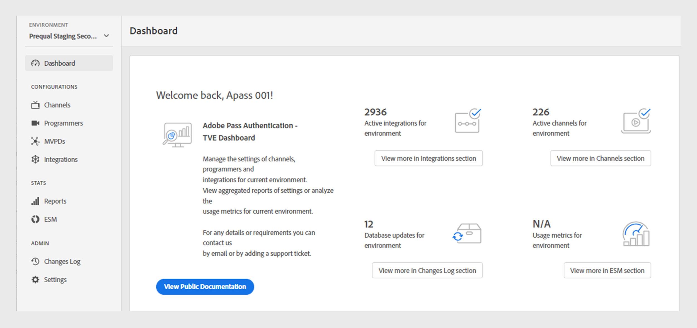

# 仪表板 {#dashboard}

>[!NOTE]
>
>此页面上的内容仅供参考。 使用此API需要来自Adobe的当前许可证。 不允许未经授权使用。

左侧面板中的&#x200B;**仪表板**&#x200B;部分用作Adobe Pass身份验证TVE仪表板的主页。

主页上有两个部分：

* [欢迎屏幕](#welcome-screen)
* [配置状态](#configuration-status)

## 欢迎屏幕 {#welcome}

在此部分中，您可以直接从欢迎消息访问公共文档，并查看当前配置的快照。

* **活动集成**：当前环境中的活动集成数。 选择&#x200B;**在集成部分**&#x200B;中查看更多内容，以访问[集成](tve-dashboard-integrations.md)部分中的详细信息。
* **活动通道**：当前环境中的活动通道数。 选择&#x200B;**在渠道部分**&#x200B;中查看更多以访问[渠道](tve-dashboard-channels.md)部分中的详细信息。
* **数据库更新**：对当前环境所做的配置更改数。 选择&#x200B;**在更改日志部分**&#x200B;中查看更多以访问[更改日志](tve-dashboard-changes-log.md)部分中的详细信息。
* **ESM仪表板**：密切关注即将推出的ESM仪表板，提供有关当前环境中属性使用情况的深入量度。 此功能将在以后的更新中访问。

*欢迎屏幕*

## 配置状态 {#conf-status}

本节介绍最近的10项配置更改，包括：

* **更改描述**：用户选择的更改的简要描述。
* **由**&#x200B;推送：负责更改的帐户。
* **推送日期**：进行更改的日期。

更改日志的

更改日志的&#x200B;*配置状态*

要查看完整的更改列表，请在右下方的更改日志&#x200B;**中选择**&#x200B;查看更多，以查看[更改日志](tve-dashboard-changes-log.md)部分。
