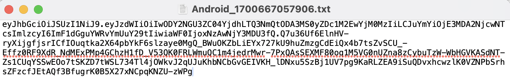

# 并发监控使用情况API访问 {#cmu-api-usage-access}

>[!NOTE]
>
>此页面上的内容仅供参考。 使用此API需要来自Adobe的当前许可证。 不允许未经授权使用。 有关可用性问题，请联系您的Adobe代表。

## 访问过程概述 {#api-access-procedure-overview}

我们已更新CMU报告访问权限，使其与OAuth 2.0动态客户端注册协议兼容。 部署自定义OAuth 2.0授权服务器以满足并发监控应用程序的需求。 \
为了使客户端应用程序能够利用OAuth 2.0授权，服务器必须动态注册以获取特定信息（客户端凭据）以便能够与其交互。 在注册过程中，客户端必须向客户端注册端点提供一组内置元数据。
此元数据作为软件语句传送，其中包含“software_id”，以允许我们的授权服务器使用相同的软件语句关联应用程序的不同实例。
软件语句是一个JSON Web令牌(JWT)，它以捆绑包的形式声明有关客户端软件的元数据值。 作为客户端注册请求的一部分向授权服务器呈现时，必须使用JSON Web签名(JWS)对软件语句进行数字签名或MAC编辑。 \
您可以在官方文档<a href="https://datatracker.ietf.org/doc/html/rfc7591" target="_blank">[RFC7591]</a>中找到有关软件语句及其工作方式的更详细说明。
请按照以下部分中的步骤获取访问权限。

## 访问过程步骤 {#access-procedure-steps}

1. 在Adobe Pass DCR服务器中注册了应用程序。 对于此步骤，请联系我们的[支持团队](mailto:tve-support@adobe.com)。

2. 获取软件声明
   1. 转到[Adobe Pass TVE仪表板](https://experience.adobe.com/#/pass/authentication)
   2. 选择程序员
   3. 转到&#x200B;*已注册的应用程序*&#x200B;选项卡
   4. 选择应用程序
   5. 在要获取软件语句的已注册应用程序行上单击下载，并将其另存为本地计算机上的文件
      <figure>
          
      </figure>

      <figure>
          
      </figure>

3. 获取访问令牌
   1. 使用以上获得的软件语句并执行下面的调用以获取客户端凭据。 这样将获得client_id - client_secret对，该对可用于获取访问令牌。
      *不应每次都执行此步骤。 仅当凭据过期时，才应再次执行此操作。*
      <figure>
          
       </figure>

   2. 使用下面的调用获取访问令牌。 使用此访问令牌可调用任何CMU API，直到令牌过期。
      *仅当上次生成的令牌过期时，才应执行此步骤。*
      <figure>
          
       </figure>

4. 调用CMU API — 请参阅以下相关信息。
   <figure>
          
       </figure>

## 相关信息 {#related-information}

* [CMU概述](/help/concurrency-monitoring/cm-usage-reports.md)
* [CMU API](/help/concurrency-monitoring/cmu-api.md)
