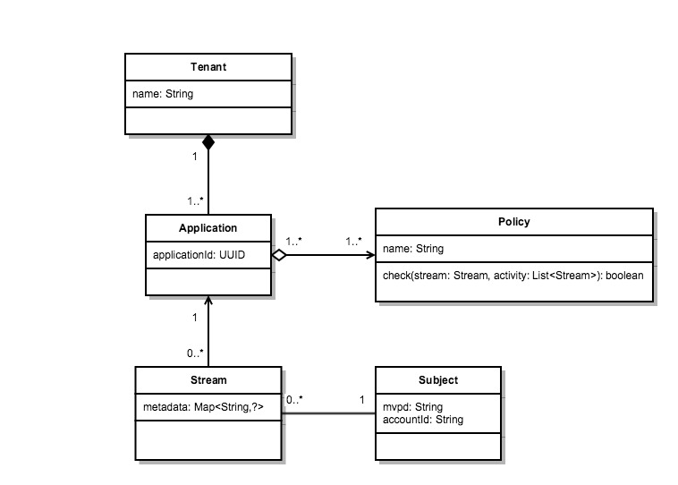
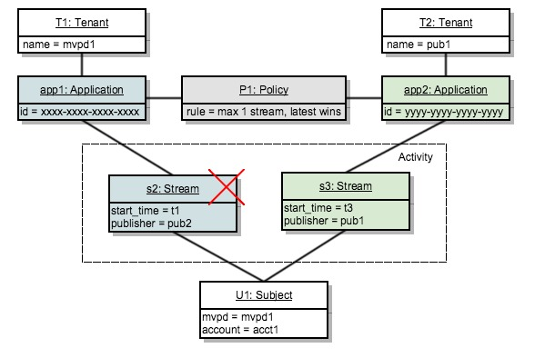

# 策略决策点 {#policy-desc-pt}

## 域模型 {#domain-model}

本页旨在作为策略的不同用例和实施的参考。 我们建议您也参阅文档的[术语表](/help/concurrency-monitoring/cm-glossary.md)部分以了解术语定义。

**租户**&#x200B;拥有&#x200B;**要强制实施**&#x200B;策略&#x200B;**的应用程序**。 **客户端应用程序**&#x200B;必须配置有&#x200B;**应用程序ID**(由Adobe提供)。

然后，租户将每个应用程序与一个或多个策略相关联，这些策略由租户创建或由其他人创建和共享。 策略可以在多个租户之间链接。

**主题活动**&#x200B;包含向特定主题并发监视报告的所有流（无论应用程序如何）。

当一个流被授权用于给定主题时，系统将首先检查为创建该流的应用程序定义的所有策略。

对于每个适用的策略，我们需要收集将传递到规则的所有&#x200B;**相关活动**。 策略P的&#x200B;**相关活动**&#x200B;将仅包含满足以下条件的流S：

**流“S”由其策略中包含策略“P”的应用程序启动。**

## 模拟运行用例 {#dry-run-use-cases}

下面的演练旨在根据某些用例验证模型。 我们将逐步做到这一点，从基本设置开始，并以各种方式增加复杂性。

### 1.一个租户。 一个应用程序。 一个政策。 一个流 {#onetenant-oneapp-onepolicy-onestream}

我们将从单个租户开始，其中关联单个应用程序和单个策略。 假设该策略声明，任何用户最多只能有一个活动流（最新的流允许播放）。

启动流后，活动将仅包含该流并允许播放。

### 2.一个租户。 一个应用程序。 一个政策。 两股。 {#onetenant-oneapp-onepolicy-twostreams}

启动第二个流（由同一主题使用同一应用程序）后，用于验证的活动将同时包含&#x200B;**s1**&#x200B;和&#x200B;**s2**。

超过限制，因为策略声明只允许播放一个流，因此我们将仅允许播放最新的流(**s2**)。

>[!NOTE]
>
>这些图显示了用户活动上的系统视图。 对于流初始化尝试，访问决策将包含在响应中。 对于活动流，将在心跳响应中返回决策。

### 3.两个租户。 两个应用程序。 一个政策。 两股。 {#twotenant-twoapp-onepolicy-twostreams}

现在，假设一个新租户希望在其应用程序中实施相同的策略：

由于两个租户由同一策略链接，因此用例2中描述的情况适用于此处，并且允许&#x200B;**s3**&#x200B;播放，因为它是最新的流。

### 4.两个租户。 三个应用程序。 两种策略。 两股。 {#twotenants-threeapps-twopolicies-twostreams}

现在，假设第二个租户部署了新应用程序并想要定义将在&#x200B;**app2**&#x200B;和&#x200B;**app3**&#x200B;之间共享的新策略。

此时，允许使用活动流&#x200B;**s3**&#x200B;和&#x200B;**s4**。 对于&#x200B;**s3**，在评估策略&#x200B;**P1**&#x200B;时，系统将仅将&#x200B;**s3**&#x200B;计为&#x200B;**相关活动** （**s4**&#x200B;与策略&#x200B;**P1**&#x200B;无关），因此不存在冲突。

策略&#x200B;**P2**&#x200B;应用于两个流，它将同时包含&#x200B;**s3**&#x200B;和&#x200B;**s4**&#x200B;作为相关活动。 由于此活动在两个流的范围内，因此允许这两个流。

### 5.两个租户。 三个应用程序。 两种策略。 三流。 {#twotenants-threeapps-twopolicies-threestreams}

现在，假定使用&#x200B;**app2**&#x200B;执行了新的流初始化尝试：

**s5**&#x200B;允许由&#x200B;**P1**&#x200B;启动（这允许较新的流接管），但&#x200B;**P2**&#x200B;拒绝它，因此它不会启动。

如果尝试使用app3初始化某个流，也会发生同样的情况：同一策略P2将拒绝对该流的访问。

现在，我们来看看如果用户尝试使用app1创建新流会发生什么情况：

应用程序app1与策略&#x200B;**P2**&#x200B;没有任何关系，因此它将只应用策略&#x200B;**P1**：该策略允许新流启动并拒绝旧流（**s3**，在本例中为）。
